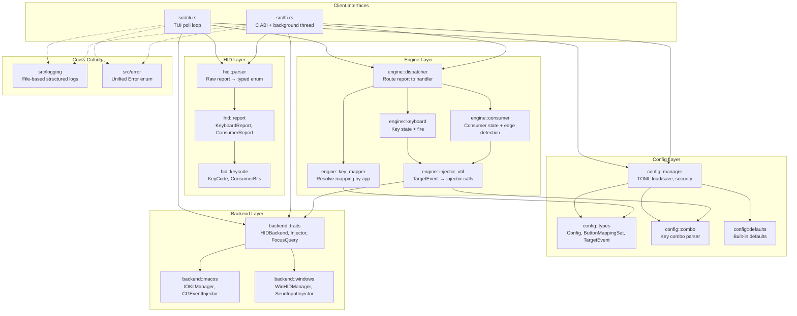

# Architecture

## Overview

Override Hub is a layered, single-threaded [HID](../modules/hid.md) remapping [engine](../modules/engine.md) that captures raw USB HID reports from a physical hub device, parses them into typed events, resolves per-application key mappings from a TOML [configuration file](../modules/config.md), and injects synthetic input events (keyboard, media, mouse, system) into the operating system.

The architecture follows a strict **four-layer hierarchy** with a **[backend](../modules/backend.md)**-trait abstraction for platform portability:

1. **Config Layer** — TOML-based configuration loading, key combo parsing, and default/profile resolution.
2. **HID Layer** — Raw binary report parsing into typed Rust enums (keyboard, consumer, media keys).
3. **Engine Layer** — Stateful event dispatch with keyboard and consumer handlers, config-to-action mapping.
4. **Backend Layer** — Platform-specific HID seizure (capture), event injection, and focus querying via compile-time trait polymorphism.

The system runs as either a [CLI](../modules/cli.md)/[TUI](../modules/tui.md) application (synchronous poll loop on the main thread) or via a C [FFI bridge](../modules/ffi.md) that spawns the engine in a background thread for macOS GUI integration.

## Component Diagram



The diagram above shows all four horizontal layers and the two client interface entry points (CLI and FFI). Arrows represent direct module dependencies. The config layer feeds into the engine layer through key mapping resolution, the HID layer provides parsed reports for dispatch, and the backend layer provides platform abstractions for seize/inject/focus. Cross-cutting modules (logging, error) are used by all layers.

## Data Flow

```mermaid
sequenceDiagram
    participant User as User Action
    participant Loop as Poll Loop<br/>(cli or ffi)
    participant Backend as Backend::HIDBackend
    participant Parser as hid::parser
    participant Dispatcher as engine::Dispatcher
    participant Mapper as engine::key_mapper
    participant Focus as backend::FocusQuery
    participant Injector as backend::Injector

    Loop->>Focus: focused_app()
    Focus-->>Loop: FocusedApp { id, name }

    Loop->>Mapper: resolve(config, app_id)
    Mapper-->>Loop: ButtonMappingSet

    Loop->>Backend: run_once(50ms)
    Backend-->>Loop: Option<Report>

    alt Some(report)
        Loop->>Parser: parse(report_bytes)
        Parser-->>Loop: typed Report

        Loop->>Dispatcher: dispatch(Report, mapping)
        
        alt Keyboard report
            Dispatcher->>Mapper: map_keycode(kc, mapping)
            Mapper-->>Dispatcher: Option<&TargetEvent>
            Dispatcher->>Injector: inject_key / inject_key_combo / ...
        else Consumer report
            Dispatcher->>Injector: inject_media_key / inject_system_event / ...
        end

        Injector-->>Dispatcher: Result
        Dispatcher-->>Loop: Result<()>
    else None (timeout)
        Note over Loop: Advance TUI / sleep
    end

    Loop->>TUI: render(state)
```

**Data flow walkthrough:**

1. **Focus resolution** — On every poll cycle the focus backend queries the operating system for the foreground application (bundle ID on macOS, executable name on Windows).
2. **Mapping resolution** — `ConfigKeyMapper::resolve` checks the focused app ID against `[[profiles]]` in the config. If a matching profile is found, its `ButtonMappingSet` is merged onto the `[default]` mapping (missing fields inherit from the default). If no profile matches, the raw default set is used.
3. **HID seizure and polling** — The platform-specific `HIDBackend` runs its event loop for up to 50ms (`run_once`). On macOS this runs `CFRunLoopRunInMode` with an IOKit input report callback that pushes reports into a shared queue. On Windows it runs a `GetMessage`/`PeekMessage` loop or raw Win32 HID polling.
4. **Report parsing** — Raw bytes from the HID callback are parsed by `hid::parser::parse` into a typed `Report` enum. The parser discriminates by report ID (0 = interface 0/1, 0x01 = interface 2 keyboard, 0x52 = interface 2 media keys, 0x3F = vendor data) and byte length.
5. **Dispatch** — `Dispatcher::dispatch` routes `Report::Keyboard` to `KeyboardHandler` and `Report::Consumer` to `ConsumerHandler`. The keyboard handler maintains a `HashSet<KeyCode>` of currently pressed keys and fires target events on rising edges (key-down transitions). The consumer handler uses an edge-detection pattern (`prev & mask == 0 && curr & mask != 0`) for volume, mute, and play/pause events.
6. **Injection** — `injector_util::fire` converts a `TargetEvent` into the appropriate `Injector` trait method call (keyboard combo, media key, system event, mouse move/click/scroll). Keyboard combos are parsed at runtime by `combo::parse_combo` which splits on `+` to extract modifiers and key name, then maps to platform virtual-key codes.
7. **TUI feedback** — The CLI updates `TuiState` with the latest report and resolved mapping labels, then renders a full-screen ANSI terminal display showing active keys, modifier status, and focused app name.

## Key Design Decisions

### 1. Seize-then-Inject Architecture

- **Context**: The hub produces both keyboard and consumer HID reports. The OS normally consumes these reports directly. To remap them, the system must prevent the OS from seeing the original events while injecting synthetic replacements.
- **Decision**: The `HIDBackend::seize()` method exclusively captures the device using platform-specific mechanisms (`kIOHIDOptionsTypeSeizeDevice` on macOS, raw input registration on Windows). Once seized, original reports are never forwarded to the OS. The engine then reads raw reports from the seized device and synthesizes remapped events through the `Injector` trait. There is no "pass-through" mode — every event is either consumed or explicitly remapped.
- **Consequences**: The application must run with elevated privileges (root on macOS via AuthorizationExecuteWithPrivileges, Administrator on Windows). If the process crashes or panics while seized, the operating system automatically releases the device handle — there is no residual device lock. The `Drop` implementation on the seize backend also explicitly releases the device. The engine loop in the FFI path uses `catch_unwind` to ensure panics are caught and the device is released gracefully.

### 2. Platform Abstraction via Compile-Time Traits

- **Context**: HID seizure, event injection, and focus querying APIs differ radically between macOS (IOKit, CoreGraphics, NSWorkspace) and Windows (Raw Input API, SendInput, Win32 GetWindowThreadProcessId).
- **Decision**: Three traits (`HIDBackend`, `Injector`, `FocusQuery`) define the abstract interface. Platform implementations live in separate modules (`backend::macos`, `backend::windows`) selected at compile time via `#[cfg(target_os = ...)]`. The selection happens at the entry point (CLI or FFI) by constructing the concrete platform types:

  ```rust
  #[cfg(target_os = "macos")]
  let (mut seize_backend, injector, focus_query) = {
      (macos::IOKitManager::new(), macos::CGEventInjector::new(), macos::NSWorkspaceFocus::new())
  };
  ```

- **Consequences**: There is zero runtime dispatch overhead — the concrete types are monomorphized. Adding a new platform (e.g., Linux) requires implementing the three traits and adding a `#[cfg(target_os = "linux")]` branch. All platform-specific code is isolated from the engine and config layers, which are fully cross-platform. The trade-off is that the engine cannot dynamically switch backends at runtime.

### 3. [Anti-Zombie Safety](../concepts/anti-zombie.md): Drop + catch_unwind + Forced Unwind

- **Context**: A seized HID device becomes permanently captured until the process explicitly releases it. If the process crashes, the kernel releases the device, but if the process enters an infinite loop or hangs without crashing, the device remains locked (a "zombie" seize). On macOS this requires physically unplugging the USB device.
- **Decision**: Three layers of protection are used:
  1. **Drop** — Both macOS and Windows seize backends implement `Drop` to call their `release()` method, so normal exits or unwinding from panics release the device.
  2. **catch_unwind** — The engine loop in the FFI path wraps the poll loop in `std::panic::catch_unwind`:
     ```rust
     let outcome = std::panic::catch_unwind(std::panic::AssertUnwindSafe(|| {
         engine_loop(&stop);
     }));
     ```
     If the inner loop panics, the catch_unwind handler sets the status to idle, and the device handle is released when the local `seize_backend` drops.
  3. **Panic = unwind** — The project pins `panic = "unwind"` in its build profiles (not `"abort"`) so that `Drop` implementations always run, and `catch_unwind` can intercept panics.
- **Consequences**: The system is resilient to unexpected failures. The trade-off is a small binary size increase from unwind tables compared to abort-on-panic.

### 4. Config Security: Safe File Descriptor Permissions

- **Context**: The engine runs with elevated privileges (root). The configuration file defines key combinations that the engine injects. A group- or world-writable config file would allow an unprivileged local attacker to inject arbitrary keystrokes (effectively arbitrary commands) into the privileged session.
- **Decision**: On Unix platforms, `manager::is_safe_file()` checks file permissions on the already-open file descriptor (not the path, avoiding TOCTOU races). Config files with group-writable (`0o020`) or world-writable (`0o002`) bits set are refused and fall back to built-in defaults. Config writes use `O_NOFOLLOW` to prevent symlink redirection, and set `fchmod 0o600` on the open fd:
  ```rust
  const O_NOFOLLOW: i32 = 0x0100;
  let file = std::fs::OpenOptions::new()
      .write(true).create(true).truncate(true)
      .custom_flags(O_NOFOLLOW)
      .open(path)?;
  // fchmod on the open fd — no path-based TOCTOU
  unsafe extern "C" { fn fchmod(filedes: i32, mode: u16) -> i32; }
  ```
- **Consequences**: The config security model prevents a significant privilege escalation vector. The trade-off is that users who accidentally leave their config writable will have their settings silently ignored, which can be confusing. The system prints a warning to stderr when this happens.

### 5. Single-Threaded Poll Loop (CLI) vs Background Thread (FFI)

- **Context**: The CLI/TUI application needs real-time rendering of HID state, while the macOS GUI application (Swift) needs a C-callable API that starts and stops the engine without blocking the main UI thread.
- **Decision**: Two entry points with different threading models:
  - **CLI**: A synchronous single-threaded loop on the main thread that does `run_once(50ms)` → parse → dispatch → render. No threading, no `Send` issues with raw FFI pointers. Ctrl+C is handled via `ctrlc` crate setting an atomic flag.
  - **FFI**: `hagibis_start()` spawns a `std::thread::spawn` that runs the engine loop in a dedicated thread. The thread's stop flag is an `Arc<AtomicBool>`. The device backends are created inside the spawned thread. Status is shared via a global `Mutex<Status>` that the Swift GUI polls via `hagibis_status_json()`.
- **Consequences**: The CLI model is simpler (zero threading issues) but blocks the main thread — acceptable for a terminal utility. The FFI model enables a native macOS GUI with a responsive menu bar and monitor overlay, at the cost of needing poison-tolerant lock helpers (`ffi_guard`, poison-recovering `Mutex::lock`) since the engine thread may panic while holding locks.

### 6. HID Report Dispatch with State Trackers

- **Context**: HID keyboard reports are "state" reports (all currently pressed keys are reported on every interrupt), while consumer reports are "edge" reports (bits are set while a control is active). Keyboard events must be fired only on rising edges (key-down transitions), not repeatedly.
- **Decision**: Two stateful handlers:
  - `KeyboardHandler` maintains a `HashSet<KeyCode>` of the previously pressed keys. On each report, it computes `new_keys.difference(&self.pressed)` to find newly pressed keys and fires target events only for those.
  - `ConsumerHandler` stores the previous consumer bits byte (`self.last`). On each report, it computes `curr & mask != 0 && prev & mask == 0` for each known bit (Vol+, Vol-, Mute, Play/Pause) to detect rising edges and fire events exactly once.
- **Consequences**: Events are fired once per physical action, not repeatedly. Keyboard releases are ignored (the engine maps press actions, not releases). Consumer "hold" events (like Vol+ while turning the knob) produce exactly one event per poll cycle where the bit is set, because each interrupt generates a rising edge when the knob starts turning.
