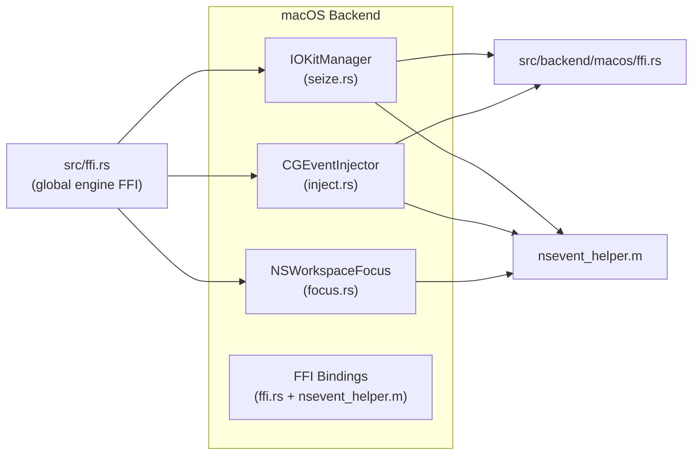

# macOS Backend

## Purpose

The macOS backend provides platform-specific implementations for the three core
[backend](../modules/backend.md) traits (HIDBackend, Injector, FocusQuery) on macOS. It owns the device
seizure via IOKit with exclusive-access flags, injects keyboard and mouse input
via CoreGraphics Quartz Event Services, and queries the frontmost application
via AppKit's NSWorkspace. A companion [C FFI layer](../modules/ffi.md) (in `src/ffi.rs` and
`gui/bridge.h`) exposes the engine lifecycle to native GUI frontends written in
Swift, C#, or any language with C ABI support.

## Key Files

| File | Role |
|------|------|
| `src/backend/macos/mod.rs` | Module root — re-exports `IOKitManager`, `CGEventInjector`, `NSWorkspaceFocus` |
| `src/backend/macos/seize.rs` | `IOKitManager` — IOHIDManager-based exclusive device seizure |
| `src/backend/macos/inject.rs` | `CGEventInjector` — CGEvent-based keyboard, mouse, media-key injection |
| `src/backend/macos/focus.rs` | `NSWorkspaceFocus` — frontmost application query via ObjC bridge |
| `src/backend/macos/ffi.rs` | Raw FFI declarations for IOKit, CoreFoundation, CoreGraphics, and NSEvent helpers |
| `src/backend/macos/nsevent_helper.m` | ObjC helpers for media-key/system-event injection and workspace focus |
| `src/ffi.rs` | Global C FFI bridge — engine lifecycle, status, config (STATUS/ENGINE/CONFIG statics) |
| `gui/bridge.h` | C header declaring the FFI functions consumed by GUI frontends |
| `gui/elevate.c` | Privilege elevation via AuthorizationExecuteWithPrivileges |

## Architecture



Three concrete structs each implement one of the platform-abstracted backend
traits. An ObjC helper file provides operations that require the AppKit runtime
(media keys, system events, frontmost application). A separate global FFI layer
in `src/ffi.rs` owns the engine thread and exposes C-callable lifecycle
functions to GUI frontends.

## IOKitManager (HIDBackend)

`IOKitManager` implements the `HIDBackend` trait and provides exclusive access
to the physical device(s) using IOKit's `IOHIDManager` with the
`kIOHIDOptionsTypeSeizeDevice` flag.

### Constructor and State

```rust
pub struct IOKitManager {
    manager: ffi::IOHIDManagerRef,
    reports: Arc<Mutex<VecDeque<Report>>>,
    ctx_ptr: *const Mutex<VecDeque<Report>>,
    removal_ctx_ptr: *const AtomicBool,
    device_present: Arc<AtomicBool>,
    running: Arc<Mutex<bool>>,
}
```

Constructed via `IOKitManager::new()`, which initialises all fields to null or
default values. The manager pointer and context pointers are populated during
`seize()`.

### Seize

`seize()` performs the following sequence:

1. Calls `IOHIDManagerCreate` to create the manager.
2. Schedules the manager on the current thread's CFRunLoop via `IOHIDManagerScheduleWithRunLoop`.
3. Builds a matching array via `build_seize_array()` targeting three device profiles:
   - `{ VendorID: 0x05AC, ProductID: 0x029C, UsagePage: 1, Usage: 6 }` (hub HID controller — keyboard)
   - `{ VendorID: 0x05AC, ProductID: 0x029C, UsagePage: 12, Usage: 1 }` (hub HID controller — consumer)
   - `{ VendorID: 0x0C76, ProductID: 0x1710, UsagePage: 12, Usage: 1 }` (audio chip — consumer)
4. Passes the matching array to `IOHIDManagerSetDeviceMatchingMultiple`.
5. Opens the manager with `kIOHIDOptionsTypeSeizeDevice` (value `1`) — this grants
   exclusive access and prevents other processes from receiving events from the device.
6. Registers the HID input report callback (`hid_report_collector`) with
   `IOHIDManagerRegisterInputReportCallback`.
7. Registers the device removal callback (`device_removal_callback`) with
   `IOHIDManagerRegisterDeviceRemovalCallback`.

### Run Loop and Polling

`run_once(timeout_ms)` runs the CFRunLoop for a short time slice
(`CFRunLoopRunInMode`) then drains one report from the internal queue. The
engine calls this repeatedly in a poll loop.

### Device Removal Detection

The `device_removal_callback` sets `device_present` to `false` via an
`AtomicBool`. The engine loop checks `is_device_present()` on each iteration and
transitions back to the SEEKING state when the device is unplugged.

### [Anti-Zombie](../concepts/anti-zombie.md) Drop Safety

The `Drop` implementation calls `self.release()`:

```rust
impl Drop for IOKitManager {
    fn drop(&mut self) {
        self.release();
    }
}
```

This guarantees that the device is released even if the engine thread panics
before reaching the explicit `release()` call. Without this guard, a panic
anywhere in the engine loop would leave the hub seized until a physical
unplug — the classic "zombie process" failure mode. `release()` is idempotent,
so a normal stop followed by this drop is a no-op.

### Release

`release()` performs orderly teardown:
1. Sets running to false.
2. Calls `IOHIDManagerUnscheduleFromRunLoop` to detach from the run loop.
3. Calls `IOHIDManagerClose` to close the manager.
4. Calls `CFRelease` on the manager to balance the +1 retain from `IOHIDManagerCreate`.
5. Reclaims the Arc pointers (`Arc::from_raw`) that were handed to the C callbacks,
   ensuring no memory leak across start/stop cycles.

Because `release()` uses `CFRunLoopGetCurrent()`, it must run on the same thread
that called `seize()`.

### [HID Report](../concepts/hid-protocol.md) Callback (`hid_report_collector`)

The `unsafe extern "C"` callback receives raw report bytes from IOKit, logs
them, parses them via `crate::hid::parser::parse`, and pushes the resulting
`Report` into the shared `VecDeque<Report>` behind a mutex.

### Matching Dictionary Builders

Private helper functions construct CF container objects:
- `cf_string(s)` — creates a `CFStringRef` from a Rust string.
- `cf_number(v)` — creates a `CFNumberRef` (SInt32) from an i32.
- `cf_dict(vid, pid, up, u)` — creates a `CFDictionaryRef` with keys
  VendorID, ProductID, PrimaryUsagePage, PrimaryUsage.

All helpers release their intermediate CF objects after the parent container
is created, relying on CF's standard `kCFType*CallBacks` to retain the
elements inside the container.

## CGEventInjector (Injector)

`CGEventInjector` implements the `Injector` trait and provides input injection
via CoreGraphics Quartz Event Services (CGEvent).

### Constructor

Creates a `CGEventSource` with `kCGEventSourceStateHIDSystemState` (state ID
`1`). The event source is reused for all injections and released on drop.

### Keyboard Injection

- `inject_key(vk, down)` — Creates a `CGEventCreateKeyboardEvent` and posts it
  to `kCGSessionEventTap` (session tap, value `1`).
- `inject_key_combo(vk, modifiers)` — Creates a key-down event, sets modifier
  flags via `CGEventSetFlags` (using `modifier_mask_to_cgflags` conversion),
  posts to `kCGSessionEventTap`, then posts a key-up event with the same flags.

The modifier conversion maps USB HID modifier bits to CGEventFlags:
- `0x01` (Ctrl) → `kCGEventFlagMaskControl` (0x40000)
- `0x02` (Shift) → `kCGEventFlagMaskShift` (0x20000)
- `0x04` (Alt) → `kCGEventFlagMaskAlternate` (0x80000)
- `0x08` (Cmd/Super) → `kCGEventFlagMaskCommand` (0x100000)

### Media and System Key Injection

- `inject_media_key(key_type)` — Routes to the ObjC helper
  `hagibis_post_media_key` for volume up/down/mute and play.
  Supported types: `0` (NX_KEYTYPE_SOUND_UP), `1` (NX_KEYTYPE_SOUND_DOWN),
  `7` (NX_KEYTYPE_MUTE), `16` (NX_KEYTYPE_PLAY).
- `inject_system_event(subtype, data)` — Routes brightness (subtype `53`) through
  the media-key pathway, and sleep (`10`), restart (`11`), shutdown (`12`),
  eject (`13`) through `hagibis_post_system_event`.

These use the NSEvent pathway because the WindowServer processes volume, media,
and power controls via `NSEventTypeSystemDefined` events, which cannot be
generated with CGEventCreateKeyboardEvent alone.

### Mouse Injection

- `inject_mouse_move(dx, dy)` — Creates a `CGEventCreateMouseEvent` with type
  `kCGEventMouseMoved` (value `5`), posts to `kCGHIDEventTap` (value `0`).
- `inject_mouse_click(btn, x, y)` — Optionally warps the cursor to `(x, y)` via
  `CGWarpMouseCursorPosition`, then posts down/up mouse events for left (type
  `1`/`2`), right (`3`/`4`), or center (`25`/`26`) buttons.
- `inject_mouse_scroll(dx, dy)` — Creates a `CGEventCreateScrollWheelEvent` with
  two wheels (vertical = `dy`, horizontal = `dx`) in line units, posts to
  `kCGHIDEventTap`.

## NSWorkspaceFocus (FocusQuery)

`NSWorkspaceFocus` implements the `FocusQuery` trait and retrieves the currently
focused application.

### focused_app()

Calls the ObjC helper `hagibis_focused_app`, which:
1. Gets `[NSWorkspace sharedWorkspace].frontmostApplication`.
2. Reads the `bundleIdentifier` and `localizedName`.
3. Copies them into provided C char buffers.

Returns `Some(FocusedApp { id, name })` on success, or `None` if no frontmost
application is available.

## ObjC NSEvent Helper (`nsevent_helper.m`)

This file provides three C-callable functions that bridge Rust code to the
AppKit runtime, avoiding direct `objc_msgSend` usage from Rust:

### hagibis_post_media_key

```objectivec
void hagibis_post_media_key(int key_code, int key_down)
```

Creates an `NSEvent` of type `NSEventTypeSystemDefined` (value `14`) with
subtype `NX_SUBTYPE_AUX_CONTROL_BUTTONS` (value `8`). The `data1` field encodes
the key code (shifted left by 16 bits) OR'd with the modifier flags
(`0xA00` for key-down, `0xB00` for key-up). Posts the event's CGEvent
representation to `kCGHIDEventTap` via `CGEventPost`.

Used for volume controls, mute, play, and brightness.

### hagibis_post_system_event

```objectivec
void hagibis_post_system_event(int subtype, int data)
```

For brightness subtypes (`NX_KEYTYPE_BRIGHTNESS_UP`/`DOWN`), delegates to
`hagibis_post_media_key`. For other subtypes — sleep (`11`), restart (`12`),
shutdown (`13`), eject (`10`) — creates an `NSEventTypeSystemDefined` event with
the given subtype and posts it to `kCGHIDEventTap`.

### hagibis_focused_app

```objectivec
int hagibis_focused_app(char *bundle_id_out, int bundle_id_cap,
                         char *name_out, int name_cap)
```

Calls `[NSWorkspace sharedWorkspace].frontmostApplication`, copies the
`bundleIdentifier` and `localizedName` into the output buffers via `snprintf`.
Returns `1` on success, `0` if no app is focused.

## Raw FFI Bindings (`src/backend/macos/ffi.rs`)

This module declares `unsafe extern "C"` function signatures and associated
constants for three frameworks:

### IOKit HID Manager
- `IOHIDManagerCreate`, `IOHIDManagerOpen`, `IOHIDManagerClose`
- `IOHIDManagerScheduleWithRunLoop`, `IOHIDManagerUnscheduleFromRunLoop`
- `IOHIDManagerSetDeviceMatching`, `IOHIDManagerSetDeviceMatchingMultiple`
- `IOHIDManagerRegisterInputReportCallback`, `IOHIDManagerRegisterDeviceRemovalCallback`
- Constants: `IOHID_OPTIONS_TYPE_SEIZE_DEVICE` (1)

### CoreFoundation
- `CFStringCreateWithCString`, `CFNumberCreate`
- `CFDictionaryCreate`, `CFArrayCreate`
- `CFRelease`, `CFRunLoopGetCurrent`, `CFRunLoopRunInMode`, `CFRunLoopStop`
- Callback globals: `kCFTypeDictionaryKeyCallBacks`,
  `kCFTypeDictionaryValueCallBacks`, `kCFTypeArrayCallBacks`
- Constants: `CF_STRING_ENCODING_UTF8` (0x0800_0100), `CF_NUMBER_SINT32_TYPE`
  (3)

### CoreGraphics
- `CGEventSourceCreate`, `CGEventCreateKeyboardEvent`
- `CGEventCreateMouseEvent`, `CGEventCreateScrollWheelEvent`
- `CGEventPost`, `CGEventSetFlags`, `CGWarpMouseCursorPosition`
- Event tap constants: `kCGHIDEventTap` (0), `kCGSessionEventTap` (1)
- Mouse event types: `kCGEventMouseMoved` (5), `kCGEventLeftMouseDown` (1),
  `kCGEventLeftMouseUp` (2), `kCGEventRightMouseDown` (3),
  `kCGEventRightMouseUp` (4), `kCGEventOtherMouseDown` (25),
  `kCGEventOtherMouseUp` (26)
- Mouse button constants: left (0), right (1), center (2)
- Scroll units: line (1), pixel (0)

## Global C FFI Bridge (`src/ffi.rs`)

The global FFI layer owns the engine thread, live config, and status reporting.
It is separate from the platform-specific raw FFI bindings.

### Global State

Three `static Mutex` globals:
- `ENGINE: Mutex<Option<Engine>>` — holds the engine thread handle, stop flag,
  and finished flag.
- `CONFIG: Mutex<Option<Config>>` — live config that the engine reads on every
  poll cycle; reloaded without restarting device seizure.
- `STATUS: Mutex<Status>` — JSON-serialisable engine status (running, seized,
  consumer state, keyboard state, focused app, mapped action labels, error).

All mutex access uses `unwrap_or_else(|e| e.into_inner())` to recover from
poisoned mutexes.

### FFI Guard

Every exported C function goes through `ffi_guard(default, f)`, which wraps the
implementation in `std::panic::catch_unwind`:

```rust
fn ffi_guard<T>(default: T, f: impl FnOnce() -> T) -> T {
    match std::panic::catch_unwind(std::panic::AssertUnwindSafe(f)) {
        Ok(v) => v,
        Err(_) => {
            logging::error_log("ffi", "panic caught at FFI boundary");
            default
        }
    }
}
```

This ensures that a Rust panic never unwinds across a C call frame, which would
be undefined behaviour.

### Exported Functions

| Function | Signature | Purpose |
|----------|-----------|---------|
| `hagibis_start` | `() -> i32` | Creates engine thread, seizes device, enters poll loop. Returns 0 on success, -1 on failure. |
| `hagibis_stop` | `() -> ()` | Signals stop flag, joins engine thread, releases device. |
| `hagibis_is_running` | `() -> i32` | Returns 1 if the engine thread is alive and not finished. |
| `hagibis_status_json` | `(char*, i32) -> i32` | Writes JSON status into buffer. Returns bytes written or 0. |
| `hagibis_config_json` | `(char*, i32) -> i32` | Writes JSON config into buffer. Returns bytes written or 0. |
| `hagibis_save_config_json` | `(const char*) -> i32` | Parses JSON, saves to disk, updates live CONFIG. |
| `hagibis_reload_config` | `() -> i32` | Reloads [config.toml](../config/config-toml.md) from disk into live CONFIG. |
| `hagibis_log` | `(i32, const char*, const char*) -> ()` | Writes a log entry at the given level. |

### Engine Loop

The engine loop (called inside a `std::thread::spawn`) alternates between two
states:

- **SEEKING** — Attempts `seize_backend.seize()` every 500ms until successful.
- **ACTIVE** — Polls `seize_backend.run_once(50)` (50ms timeout), dispatches
  parsed HID reports via `ConfigKeyMapper` and `Dispatcher`, tracks keyboard and
  consumer state in STATUS, checks `is_device_present()` on macOS. Transitions
  back to SEEKING on device unplug or error.

The engine thread itself wraps the loop body in `catch_unwind` so that a panic
in the inner loop is caught, the device is released via `Drop`, and the engine
thread terminates cleanly.

## Privilege Elevation (`gui/elevate.c`)

```c
int hagibis_elevate(const char *path)
```

Uses `AuthorizationCreate` and `AuthorizationExecuteWithPrivileges` (deprecated
since macOS 10.15) to re-launch the GUI executable at `path` with root
privileges, passing `"--elevated"` as an argument. This is needed because
`kIOHIDOptionsTypeSeizeDevice` requires root access. The function does not
block — the child process runs asynchronously.

The deprecation warning is explicitly suppressed with a clang pragma:
```c
#pragma clang diagnostic ignored "-Wdeprecated-declarations"
```
