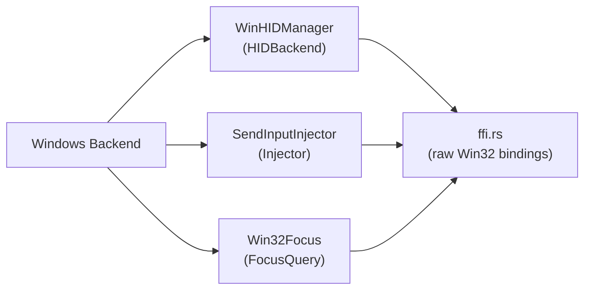

# Windows Backend

## Purpose

Provides the Windows platform implementation for three core [backend](../modules/backend.md) traits: [HID report](../concepts/hid-protocol.md) interception (`HIDBackend`), synthetic input injection (`Injector`), and foreground application detection (`FocusQuery`). It uses Win32 APIs directly via raw FFI declarations rather than the `windows-rs` crate, keeping the dependency footprint minimal. The implementation covers keyboard/mouse/consumer-control HID capture through `RegisterRawInputDevices`, input synthesis through `SendInput`, and process detection through the `GetForegroundWindow` → `OpenProcess` → `QueryFullProcessImageNameW` pipeline.

## Key Files

| File | Role |
|------|------|
| `mod.rs` | Module root; re-exports the three public types |
| `seize.rs` | `WinHIDManager` — RawInput-based HID report interception |
| `inject.rs` | `SendInputInjector` — keyboard, mouse, media, and system-event injection |
| `focus.rs` | `Win32Focus` — foreground window and process name detection |
| `ffi.rs` | Raw `extern "system"` FFI declarations for user32, kernel32, SetupAPI, and hid.dll |

## Architecture



The three implementations share no mutable state and are independent of each other. All three depend on `ffi.rs` for raw Win32 function declarations and type definitions.

## Public API

### WinHIDManager (`seize.rs`)

Implements the `HIDBackend` trait for intercepting HID reports from the hub device before they reach foreground applications.

| Method | Signature | Description |
|--------|-----------|-------------|
| `new` | `fn new() -> Self` | Creates an unseized manager with an empty report queue |
| `seize` | `fn seize(&mut self) -> Result<(), Error>` | Registers a message-only window and raw-input devices for keyboard (UsagePage=1, Usage=6) and consumer control (UsagePage=12, Usage=1) |
| `run_once` | `fn run_once(&mut self, timeout_ms: u32) -> Result<Option<Report>, Error>` | Pumps one window message, dispatches it through `WndProc`, and returns the first queued HID report if any |
| `release` | `fn release(&mut self)` | Destroys the window, unregisters the window class, and clears the global report queue reference |

Additionally implements `Drop` to call `release()` automatically if the owning thread unwinds.

### SendInputInjector (`inject.rs`)

Implements the `Injector` trait for synthesizing keyboard, mouse, media, and system events.

| Method | Signature | Description |
|--------|-----------|-------------|
| `new` | `fn new() -> Self` | Creates a new injector instance |
| `inject_key` | `fn inject_key(&self, vk: u16, down: bool) -> Result<(), Error>` | Presses or releases a virtual key via `SendInput` with `KEYBDINPUT` |
| `inject_key_combo` | `fn inject_key_combo(&self, vk: u16, modifiers: u8) -> Result<(), Error>` | Sends a key combination: press modifiers (bitmask: 1=Ctrl, 2=Shift, 4=Alt, 8=Win), press+release main key, release modifiers in reverse |
| `inject_media_key` | `fn inject_media_key(&self, key_type: u8) -> Result<(), Error>` | Presses and releases a media key mapped from `key_type` (0=VolumeUp, 1=VolumeDown, 7=Mute, 16=PlayPause) |
| `inject_system_event` | `fn inject_system_event(&self, subtype: u16, data: i32) -> Result<(), Error>` | Triggers system events: sleep (`SetSuspendState`), restart/shutdown (`ExitWindowsEx`), or brightness fallback (delegates to `inject_media_key`) |
| `inject_mouse_move` | `fn inject_mouse_move(&self, dx: f64, dy: f64) -> Result<(), Error>` | Moves the mouse cursor by relative delta via `MOUSEINPUT` with `MOUSEEVENTF_MOVE` |
| `inject_mouse_click` | `fn inject_mouse_click(&self, btn: u8, _x: Option<f64>, _y: Option<f64>) -> Result<(), Error>` | Sends mouse down+up events for left (1), right (2), or middle (3) button |
| `inject_mouse_scroll` | `fn inject_mouse_scroll(&self, dx: f64, dy: f64) -> Result<(), Error>` | Sends vertical scroll (`MOUSEEVENTF_WHEEL`, WHEEL_DELTA=120) and/or horizontal scroll (`MOUSEEVENTF_HWHEEL`) events |

### Win32Focus (`focus.rs`)

Implements the `FocusQuery` trait for detecting the currently focused application.

| Method | Signature | Description |
|--------|-----------|-------------|
| `new` | `fn new() -> Self` | Creates a new focus query instance |
| `focused_app` | `fn focused_app(&self) -> Option<FocusedApp>` | Returns the name and id of the foreground application by calling `GetForegroundWindow` → `GetWindowThreadProcessId` → `OpenProcess(PROCESS_QUERY_LIMITED_INFORMATION)` → `QueryFullProcessImageNameW`, extracting the file stem as the app name |

## Window Procedure and Message Loop

`WinHIDManager` uses a **message-only window** (`HWND_MESSAGE = -3`) to receive raw input messages without creating a visible window. The lifecycle is:

1. **Window class registration**: `RegisterClassExW` registers a class named `"HagibisHubMapper\0"` with `wndproc` as the window procedure.

2. **Window creation**: `CreateWindowExW` creates a message-only window (parent set to `HWND_MESSAGE`).

3. **Raw input device registration**: `RegisterRawInputDevices` is called with two `RAWINPUTDEVICE` entries:

   | UsagePage | Usage | Description | Flags |
   |-----------|-------|-------------|-------|
   | 1 (Generic Desktop) | 6 (Keyboard) | Standard keyboard input | `RIDEV_INPUTSINK` \| `RIDEV_EXCLUDE` |
   | 12 (Consumer) | 1 (Consumer Control) | Media/volume keys | `RIDEV_INPUTSINK` \| `RIDEV_EXCLUDE` |

   - `RIDEV_INPUTSINK` — receive raw input even when the window is not in the foreground.
   - `RIDEV_EXCLUDE` — the application does not want legacy keyboard messages; combined with returning 0 from `WndProc`, this blocks the original events from reaching the foreground window.

4. **Message pump** (`run_once`): Calls `PeekMessageW` with `PM_REMOVE`. If a `WM_QUIT` is received, sets the running flag to false. Otherwise calls `TranslateMessage` + `DispatchMessageW` to route the message to `wndproc`.

5. **Sleep fallback**: If no message is pending, the thread sleeps for `timeout_ms` milliseconds to avoid busy-waiting.

### The WndProc Function

The `wndproc` (lines 59-180 of `seize.rs`) handles `WM_INPUT` (0x00FF):

1. Calls `GetRawInputData` with `RID_INPUT` to retrieve the raw input buffer, first querying the required size, then allocating a `Vec<u8>` and fetching the data.

2. Casts the buffer to `RAWINPUTHEADER` and checks `dwType == RIM_TYPEHID` (type 2). Non-HID messages (legacy keyboard/mouse) are passed to `DefWindowProcW` and thus ignored — only the hub's HID reports are intercepted.

3. **Device filtering**: Calls `GetRawInputDeviceInfoW` with `RIDI_DEVICEINFO` to get `RID_DEVICE_INFO`. Checks `dwVendorId` and `dwProductId` against the known hub VID/PID pairs:
   - `0x05AC:0x029C`
   - `0x0C76:0x1710`
   
   If the device does not match, the message is passed to `DefWindowProcW`, allowing non-hub keyboards and consumer controls to function normally.

4. **Report parsing**: After the `RAWINPUTHEADER`, the HID data is structured as `RAWHID`: `dwSizeHid` (4 bytes) + `dwCount` (4 bytes) + `bRawData[]`. The raw HID bytes are extracted and passed to the shared `parse()` function from `crate::hid::parser`, which produces a `Report`.

5. **Queuing**: The `Report` is pushed onto a `VecDeque<Report>` protected by `Arc<Mutex<...>>`. A global static `G_REPORTS: Mutex<Option<Arc<Mutex<VecDeque<Report>>>>>` bridges the gap between the `extern "system"` callback (which cannot access `self`) and the `WinHIDManager` instance.

6. **Blocking**: Returns `0` instead of calling `DefWindowProcW` for hub reports. Together with `RIDEV_EXCLUDE`, this prevents the hub's HID reports from being translated into `WM_KEYDOWN`/`WM_KEYUP` messages that foreground applications would receive.

## SendInput Structures

`SendInputInjector` builds `INPUT` structures and passes them to `SendInput`. Two union variants are used:

### KEYBDINPUT (keyboard events)

```c
struct KEYBDINPUT {
    wVk: u16,        // Virtual-key code (e.g. VK_CONTROL = 0x11)
    wScan: u16,      // Hardware scan code (set to 0 — Windows generates it)
    dwFlags: u32,    // 0 = key down, KEYEVENTF_KEYUP (0x0002) = key up
    time: u32,       // 0 = default timestamp
    dwExtraInfo: usize,
}
```

### MOUSEINPUT (mouse events)

```c
struct MOUSEINPUT {
    dx: i32,         // Relative X delta
    dy: i32,         // Relative Y delta
    mouseData: u32,  // Scroll: WHEEL_DELTA (120) per notch; click: 0
    dwFlags: u32,    // MOVE, LEFTDOWN, LEFTUP, RIGHTDOWN, RIGHTUP, etc.
    time: u32,
    dwExtraInfo: usize,
}
```

### Virtual Key Codes Used

| Constant | Value | Usage |
|----------|-------|-------|
| `VK_CONTROL` | 0x11 | Modifier bit 1 |
| `VK_SHIFT` | 0x10 | Modifier bit 2 |
| `VK_MENU` (Alt) | 0x12 | Modifier bit 4 |
| `VK_LWIN` | 0x5B | Modifier bit 8 |
| `VK_VOLUME_UP` | 0xAF | Media key type 0 |
| `VK_VOLUME_DOWN` | 0xAE | Media key type 1 |
| `VK_VOLUME_MUTE` | 0xAD | Media key type 7 |
| `VK_MEDIA_PLAY_PAUSE` | 0xB3 | Media key type 16 |

### System Events

| Subtype | API | Description |
|---------|-----|-------------|
| 11 | `SetSuspendState(0, 0, 0)` | Sleep (not hibernate) |
| 12 | `ExitWindowsEx(EWX_REBOUT \| EWX_FORCE, ...)` | Force restart |
| 13 | `ExitWindowsEx(EWX_SHUTDOWN \| EWX_FORCE, ...)` | Force shutdown |
| 53 | Delegates to `inject_media_key(data as u8)` | Brightness fallback via media key |

## FFI Bindings

The `ffi.rs` file contains raw `extern "system"` declarations across four Windows DLLs:

- **user32.dll**: `SendInput`, `GetForegroundWindow`, `GetWindowThreadProcessId`, `RegisterRawInputDevices`, `GetRawInputData`, `GetRawInputDeviceInfoW`, window class registration, message pumping, `DefWindowProcW`, `ExitWindowsEx`.
- **kernel32.dll**: `OpenProcess`, `QueryFullProcessImageNameW`, `CloseHandle`, `CreateFileW`, `ReadFile`, `SetSuspendState`.
- **SetupAPI.dll**: `SetupDiGetClassDevsW`, `SetupDiEnumDeviceInterfaces`, `SetupDiGetDeviceInterfaceDetailW`, `SetupDiDestroyDeviceInfoList`.
- **hid.dll**: `HidD_GetAttributes`, `HidD_GetPreparsedData`, `HidD_FreePreparsedData`.

All types use `#[repr(C)]` layout and manual type aliases (`HANDLE`, `HWND`, `DWORD`, etc.) with `non_camel_case_types` and `non_snake_case` allow attributes.

## Thread Safety

- `WinHIDManager` uses `Arc<Mutex<VecDeque<Report>>>` to share the report queue between the instance and the `extern "system"` window procedure, which runs on the same thread via the message pump. A global `G_REPORTS: Mutex<Option<...>>` static stores a clone of the `Arc` so `wndproc` can access it without capturing `self`.
- `SendInputInjector` is stateless and can be used from any thread.
- `Win32Focus` is stateless and can be used from any thread.
