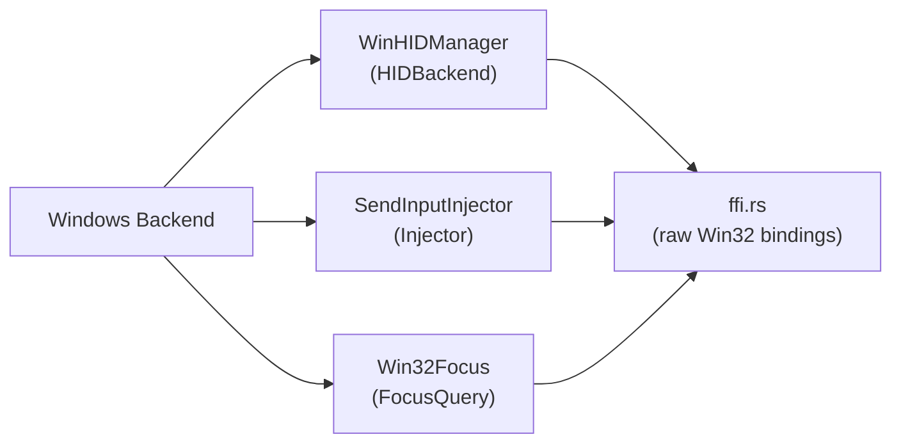

# Windows Backend

## Purpose

Provides the Windows platform implementation for three core [backend](../modules/backend.md) traits: [HID report](../concepts/hid-protocol.md) interception (`HIDBackend`), synthetic input injection (`Injector`), and foreground application detection (`FocusQuery`). It uses Win32 APIs directly via raw FFI declarations rather than the `windows-rs` crate, keeping the dependency footprint minimal. The implementation covers keyboard/mouse/consumer-control HID capture through `RegisterRawInputDevices`, global keyboard event suppression through `SetWindowsHookEx(WH_KEYBOARD_LL)`, device removal detection through `WM_DEVICECHANGE` + `RegisterDeviceNotificationW`, input synthesis through `SendInput`, and process detection through the `GetForegroundWindow` → `OpenProcess` → `QueryFullProcessImageNameW` pipeline.

## Key Files

| File | Role |
|------|------|
| `mod.rs` | Module root; re-exports the three public types |
| `seize.rs` | `WinHIDManager` — RawInput HID capture, WH_KEYBOARD_LL hook, WM_DEVICECHANGE |
| `inject.rs` | `SendInputInjector` — keyboard, mouse, media, and system-event injection |
| `focus.rs` | `Win32Focus` — foreground window and process name detection |
| `ffi.rs` | Raw `extern "system"` FFI declarations for user32, kernel32, and device notification APIs |

## Architecture



The three implementations share no mutable state and are independent of each other. All three depend on `ffi.rs` for raw Win32 function declarations and type definitions.

## Public API

### WinHIDManager (`seize.rs`)

Implements the `HIDBackend` trait for intercepting HID reports from the hub device before they reach foreground applications.

**Fields:**

| Field | Type | Description |
|-------|------|-------------|
| `reports` | `Arc<Mutex<VecDeque<Report>>>` | Shared queue between wndproc and `run_once()` |
| `window` | `ffi::HWND` | Handle to the message-only window |
| `hub_devices` | `Vec<ffi::HANDLE>` | Raw-input device handles belonging to the hub |
| `running` | `Arc<Mutex<bool>>` | Flag set by `seize()`, cleared by `release()` or `WM_QUIT` |
| `device_present` | `Arc<AtomicBool>` | Tracks hub physical connection via `WM_DEVICECHANGE` |
| `hook_handle` | `ffi::HHOOK` | `WH_KEYBOARD_LL` hook handle, or 0 when not installed |

**Methods:**

| Method | Signature | Description |
|--------|-----------|-------------|
| `new` | `fn new() -> Self` | Creates an unseized manager with all fields null/empty |
| `seize` | `fn seize(&mut self) -> Result<(), Error>` | Registers a message-only window, raw-input devices, a `WH_KEYBOARD_LL` global keyboard hook for event suppression, and a device notification for `WM_DEVICECHANGE` removal detection |
| `run_once` | `fn run_once(&mut self, timeout_ms: u32) -> Result<Option<Report>, Error>` | Drains pending `WM_INPUT` messages through the wndproc (populating the hub VK map for the hook), then pumps one general message and returns the first queued HID report |
| `is_device_present` | `fn is_device_present(&self) -> bool` | Returns whether the hub is physically connected (set by `WM_DEVICECHANGE`) |
| `release` | `fn release(&mut self)` | Uninstalls the `WH_KEYBOARD_LL` hook, clears the hub VK tracker, destroys the window, unregisters the window class, and clears global state |

Additionally implements `Drop` to call `release()` automatically if the owning thread unwinds.

### SendInputInjector (`inject.rs`)

Implements the `Injector` trait for synthesizing keyboard, mouse, media, and system events.

| Method | Signature | Description |
|--------|-----------|-------------|
| `new` | `fn new() -> Self` | Creates a new injector instance |
| `inject_key` | `fn inject_key(&self, vk: u16, down: bool) -> Result<(), Error>` | Presses or releases a virtual key via `SendInput` with `KEYBDINPUT` |
| `inject_key_combo` | `fn inject_key_combo(&self, vk: u16, modifiers: u8) -> Result<(), Error>` | Sends a key combination: press modifiers (bitmask: 1=Ctrl, 2=Shift, 4=Alt, 8=Win), press+release main key, release modifiers in reverse |
| `inject_media_key` | `fn inject_media_key(&self, key_type: u8) -> Result<(), Error>` | Presses and releases a media key mapped from `key_type`. Supported: 0=VolUp, 1=VolDown, 7=Mute, 16=PlayPause, 17=NextTrack, 18=PrevTrack. Unmapped types (2–6, 8–15, 19–23) return `Error::Inject` |
| `inject_system_event` | `fn inject_system_event(&self, subtype: u16, data: i32) -> Result<(), Error>` | Triggers system events: sleep (`SetSuspendState`), restart/shutdown (`ExitWindowsEx`). Brightness (53) and eject (10) return `Error::Inject` with explicit messages |
| `inject_mouse_move` | `fn inject_mouse_move(&self, dx: f64, dy: f64) -> Result<(), Error>` | Moves the mouse cursor by relative delta via `MOUSEINPUT` with `MOUSEEVENTF_MOVE` |
| `inject_mouse_click` | `fn inject_mouse_click(&self, btn: u8, _x: Option<f64>, _y: Option<f64>) -> Result<(), Error>` | Sends mouse down+up events for left (1), right (2), or middle (3) button |
| `inject_mouse_scroll` | `fn inject_mouse_scroll(&self, dx: f64, dy: f64) -> Result<(), Error>` | Sends vertical scroll (`MOUSEEVENTF_WHEEL`, WHEEL_DELTA=120) and/or horizontal scroll (`MOUSEEVENTF_HWHEEL`) events |

### Win32Focus (`focus.rs`)

Implements the `FocusQuery` trait for detecting the currently focused application.

| Method | Signature | Description |
|--------|-----------|-------------|
| `new` | `fn new() -> Self` | Creates a new focus query instance |
| `focused_app` | `fn focused_app(&self) -> Option<FocusedApp>` | Returns the name and id of the foreground application by calling `GetForegroundWindow` → `GetWindowThreadProcessId` → `OpenProcess(PROCESS_QUERY_LIMITED_INFORMATION)` → `QueryFullProcessImageNameW`, extracting the file stem as the app name |

## Window Procedure and Message Loop

`WinHIDManager` uses a **message-only window** (`HWND_MESSAGE = -3`) to receive raw input and device change messages without creating a visible window. The lifecycle is:

1. **Window class registration**: `RegisterClassExW` registers a class named `"HagibisHubMapper\0"` with `wndproc` as the window procedure.

2. **Window creation**: `CreateWindowExW` creates a message-only window (parent set to `HWND_MESSAGE`).

3. **Raw input device registration**: `RegisterRawInputDevices` is called with two `RAWINPUTDEVICE` entries:

   | UsagePage | Usage | Description | Flags |
   |-----------|-------|-------------|-------|
   | 1 (Generic Desktop) | 6 (Keyboard) | Standard keyboard input | `RIDEV_INPUTSINK` \| `RIDEV_EXCLUDE` |
   | 12 (Consumer) | 1 (Consumer Control) | Media/volume keys | `RIDEV_INPUTSINK` \| `RIDEV_EXCLUDE` |

   - `RIDEV_INPUTSINK` — receive raw input even when the window is not in the foreground.
   - `RIDEV_EXCLUDE` — the application does not want legacy keyboard messages; combined with returning 0 from `WndProc`, this blocks the original events from reaching the foreground window.

4. **Low-level keyboard hook**: `SetWindowsHookExW(WH_KEYBOARD_LL, ...)` installs a global keyboard hook that intercepts all keyboard events system-wide before they reach foreground windows. The hook callback checks `G_HUB_VKCODES` (populated by the wndproc as hub keyboard reports arrive) and returns 1 (blocked) for hub-originated VK codes, or calls `CallNextHookEx` to pass through non-hub events. This suppresses hub keyboard events that might not be intercepted by RawInput alone (e.g., keys on the keyboard usage page that the OS translates to `WM_KEYDOWN` before the `WM_INPUT` message is delivered).

5. **Device notification**: During `seize()`, the wndproc begins handling `WM_DEVICECHANGE` messages. When a device is removed (`DBT_DEVICEREMOVECOMPLETE`) or arrives (`DBT_DEVICEARRIVAL`), the wndproc examines the `DEV_BROADCAST_DEVICEINTERFACE_W` structure and filters by VID (`VID_05AC` for Apple, `VID_0C76` for the specific hub chipset). Only matching VID/PID events update the `G_DEVICE_PRESENT` atomic flag, preventing unrelated device plug/unplug events from spuriously transitioning the engine to SEEKING state.

6. **Message pump** (`run_once`): Runs a two-phase message drain:

   - **Phase 1: WM_INPUT drain loop** — Calls `PeekMessageW` with a `WM_INPUT` filter (`PM_REMOVE`) in a tight loop to drain all pending raw input messages first. This ensures `G_HUB_VKCODES` is up to date with the latest hub keyboard state before the WH_KEYBOARD_LL hook fires during the general message pump. If `WM_QUIT` is received during this drain, the running flag is cleared and `None` is returned.

   - **Phase 2: General message pump** — Calls `PeekMessageW` without filters. If a message is available, it is dispatched through `TranslateMessage` + `DispatchMessageW`. Otherwise, the thread sleeps for `timeout_ms` milliseconds.

   After both phases, the first queued `Report` is popped from the shared queue and returned.

### The WndProc Function

The `wndproc` (lines 177-376 of `seize.rs`) handles two message types:

#### WM_DEVICECHANGE (0x0219)

Checks `wParam` for `DBT_DEVICEREMOVECOMPLETE` or `DBT_DEVICEARRIVAL`. If `lParam` points to a valid `DEV_BROADCAST_DEVICEINTERFACE_W` structure with `dbcc_devicetype == DBT_DEVTYP_DEVICEINTERFACE`, the device name is extracted and checked for known hub VIDs (`VID_05AC` or `VID_0C76`). On a matching removal, `G_DEVICE_PRESENT` is set to `false`; on a matching arrival, it is set to `true`. The message is always passed to `DefWindowProcW` after processing.

#### WM_INPUT (0x00FF)

1. Calls `GetRawInputData` with `RID_INPUT` to retrieve the raw input buffer, first querying the required size, then allocating a `Vec<u8>` and fetching the data.

2. Casts the buffer to `RAWINPUTHEADER` and checks `dwType == RIM_TYPEHID` (type 2). Non-HID messages (legacy keyboard/mouse) are passed to `DefWindowProcW` and thus ignored — only the hub's HID reports are intercepted.

3. **Device filtering**: Calls `GetRawInputDeviceInfoW` with `RIDI_DEVICEINFO` to get `RID_DEVICE_INFO`. Checks `dwVendorId` and `dwProductId` against the known hub VID/PID pairs:
   - `0x05AC:0x029C`
   - `0x0C76:0x1710`

   If the device does not match, the message is passed to `DefWindowProcW`, allowing non-hub keyboards and consumer controls to function normally.

4. **Report parsing**: After the `RAWINPUTHEADER`, the HID data is structured as `RAWHID`: `dwSizeHid` (4 bytes) + `dwCount` (4 bytes) + `bRawData[]`. The raw HID bytes are extracted and passed to the shared `parse()` function from `crate::hid::parser`, which produces a `Report`.

5. **VK tracking for hook suppression**: If the report is a `Report::Keyboard`, the wndproc clears and repopulates `G_HUB_VKCODES` by mapping every pressed HID keyboard-page usage ID to its Windows virtual-key code via `hid_kbd_usage_to_vk()`. Modifier bits (Ctrl, Shift, Alt, Win) are also mapped, with left/right variants merged into the same VK (the hook does not distinguish left/right). This map is consumed by `low_level_keyboard_hook` to suppress hub-originated events.

6. **Queuing**: The `Report` is pushed onto the `VecDeque<Report>` shared via `G_REPORTS`.

7. **Blocking**: Returns `0` instead of calling `DefWindowProcW` for hub reports. Together with `RIDEV_EXCLUDE`, this prevents the hub's HID reports from being translated into `WM_KEYDOWN`/`WM_KEYUP` messages that foreground applications would receive.

### Key Name Mappings

The `hid_kbd_usage_to_vk()` function maps HID keyboard-page usage IDs (0x04–0x56) to Windows virtual-key codes. Non-standard keys include:

| Key | HID Usage | VK Constant | VK Code |
|-----|-----------|-------------|---------|
| PrintScreen | 0x46 | `VK_SNAPSHOT` | 0x2C |
| ScrollLock | 0x47 | `VK_SCROLL` | 0x91 |
| Pause | 0x48 | `VK_PAUSE` | 0x13 |
| Insert | 0x49 | `VK_INSERT` | 0x2D |
| CapsLock | 0x39 | `VK_CAPITAL` | 0x14 |
| Menu (App) | via `VK_MENU` | 0x12 | (Alt, used as modifier) |

## SendInput Structures

`SendInputInjector` builds `INPUT` structures and passes them to `SendInput`. Two union variants are used:

### KEYBDINPUT (keyboard events)

```c
struct KEYBDINPUT {
    wVk: u16,        // Virtual-key code (e.g. VK_CONTROL = 0x11)
    wScan: u16,      // Hardware scan code (set to 0 — Windows generates it)
    dwFlags: u32,    // 0 = key down, KEYEVENTF_KEYUP (0x0002) = key up
    time: u32,       // 0 = default timestamp
    dwExtraInfo: usize,
}
```

### MOUSEINPUT (mouse events)

```c
struct MOUSEINPUT {
    dx: i32,         // Relative X delta
    dy: i32,         // Relative Y delta
    mouseData: u32,  // Scroll: WHEEL_DELTA (120) per notch; click: 0
    dwFlags: u32,    // MOVE, LEFTDOWN, LEFTUP, RIGHTDOWN, RIGHTUP, etc.
    time: u32,
    dwExtraInfo: usize,
}
```

### Virtual Key Codes Used

| Constant | Value | Usage |
|----------|-------|-------|
| `VK_CONTROL` | 0x11 | Modifier bit 1 |
| `VK_SHIFT` | 0x10 | Modifier bit 2 |
| `VK_MENU` (Alt) | 0x12 | Modifier bit 4 |
| `VK_LWIN` | 0x5B | Modifier bit 8 |
| `VK_VOLUME_UP` | 0xAF | Media key type 0 |
| `VK_VOLUME_DOWN` | 0xAE | Media key type 1 |
| `VK_VOLUME_MUTE` | 0xAD | Media key type 7 |
| `VK_MEDIA_PLAY_PAUSE` | 0xB3 | Media key type 16 |
| `VK_MEDIA_NEXT_TRACK` | 0xB0 | Media key type 17 |
| `VK_MEDIA_PREV_TRACK` | 0xB1 | Media key type 18 |

### System Events

| Subtype | API | Description |
|---------|-----|-------------|
| 10 | Returns `Error::Inject("Eject is not implemented on Windows...")` | No equivalent API in user session |
| 11 | `SetSuspendState(0, 0, 0)` | Sleep (not hibernate) |
| 12 | `ExitWindowsEx(EWX_REBOOT \| EWX_FORCE, ...)` | Force restart |
| 13 | `ExitWindowsEx(EWX_SHUTDOWN \| EWX_FORCE, ...)` | Force shutdown |
| 53 | Returns `Error::Inject("brightness control is not implemented on Windows...")` | Deferred to v1.1: WMI/DXVA2 |

## Known Limitations

### Brightness Control (subtype 53)

Windows does not expose a simple user-mode API for monitor brightness. The standard approaches — WMI (`WmiMonitorBrightnessMethods`) and DXVA2 (`GetMonitorBrightness`/`SetMonitorBrightness`) — require per-monitor enumeration and are deferred to v1.1. The engine returns `Error::Inject` with message `"brightness control is not implemented on Windows (deferred to v1.1: WMI/DXVA2)"`.

### Eject (subtype 10)

There is no Windows user-session API equivalent to macOS's `IOKit` media-eject call. The engine returns `Error::Inject` with message `"Eject is not implemented on Windows (no equivalent API in user session)"`.

### Unsupported Media Key Types

The following consumer-page key types have no Windows virtual-key equivalent. They all return `Error::Inject` with a descriptive message:

| Key Types | Range | Examples |
|-----------|-------|----------|
| 2–6 | Scan codes, bass/treble | Scan Next/Previous Track, Stop, Bass Boost, Treble Up/Down |
| 8–15 | Transport, menu, pick | Stop/Eject, Play, Pause, Record, Fast Forward, Rewind, Menu, Select |
| 19–23 | Channel, menu nav | Channel Up/Down, Menu Escape/Right/Left/Up/Down |

These types map to consumer-page HID usages that Windows does not translate to virtual keys. Adding support would require `SendInput` with hardware scan codes mapped from the HID consumer usage table, or direct consumer-page HID output report injection — both deferred to a future release.

### Consumer-Page Event Leakage

The `WH_KEYBOARD_LL` low-level keyboard hook intercepts **keyboard-page** events only (UsagePage 1). Consumer-page HID events (UsagePage 12: volume up/down, mute, play/pause) processed through the HID stack may still generate media key messages that the OS delivers to foreground applications before the RawInput path captures them. The RawInput registration (`RIDEV_INPUTSINK | RIDEV_EXCLUDE`) blocks these for the hub device specifically, but the hook cannot serve as a secondary suppression layer because consumer HID usages do not produce `KBDLLHOOKSTRUCT`-compatible events. This is a known limitation of the Windows input stack — consumer-page events take a different code path than keyboard-page events.

### Focus App ID Format

On macOS, the focused app ID is a bundle identifier (e.g. `com.apple.Safari`). On Windows, it is the **executable file stem** (e.g. `chrome`, `Code`). This difference is expected and documented — it reflects the underlying platform APIs (`QueryFullProcessImageNameW` extracts the executable name, while macOS uses `NSRunningApplication.bundleIdentifier`). Config profiles must use the Windows-compatible format when targeting Windows applications.

## Security & Privilege Model

**No Administrator elevation is required.** All APIs used by the Windows backend operate from user-level (Medium integrity level) processes with no UAC prompt:

| API | Privilege Required | Purpose |
|-----|--------------------|---------|
| `RegisterRawInputDevices` | None | Register for raw HID input from the hub |
| `SetWindowsHookEx(WH_KEYBOARD_LL)` | None (user) | Global keyboard event suppression via hook |
| `SendInput` | None | Synthetic keyboard, mouse, and media key injection |
| `RegisterDeviceNotificationW` | None | USB device removal/arrival detection via `WM_DEVICECHANGE` |
| `GetForegroundWindow` + `OpenProcess` + `QueryFullProcessImageNameW` | None | Foreground application detection |

### Contrast with macOS

The security model is fundamentally different from macOS. On macOS, `kIOHIDOptionsTypeSeizeDevice` requires root privileges because it grants exclusive access to a kernel-level HID device. The macOS backend obtains these privileges via `AuthorizationExecuteWithPrivileges` in the GUI launcher.

On Windows, there is no equivalent "exclusive device seizure" concept. Instead:

1. **RawInput** (`RegisterRawInputDevices` with `RIDEV_INPUTSINK | RIDEV_EXCLUDE`) captures HID reports for the hub device while blocking their translation to legacy window messages — but does so without exclusive access. Any process can register for raw input from the same device.

2. **WH_KEYBOARD_LL hook** provides a secondary suppression layer: it intercepts all keyboard events system-wide and blocks those originating from hub VK codes. This is a **global hook** that runs in the context of every GUI thread on the desktop — this is the documented design of `WH_KEYBOARD_LL`, not a privilege escalation. The hook's DLL is the process's own `.exe` (loaded via `GetModuleHandleW(NULL)`), not a third-party DLL.

3. **No kernel-level seizure** — Windows does not expose a user-mode API for exclusive HID device capture. The two-layer approach (RawInput + hook) provides equivalent functionality without elevation.

The result: the Windows backend achieves the same "seize-then-inject" pattern as macOS, but through a fundamentally different privilege model that never requires Administrator rights.

## Security Considerations

### DLL Hijacking via Hook

**Threat**: An attacker could replace the DLL loaded by the hook with a malicious version, intercepting all keystrokes system-wide.

**Mitigation**: The hook uses `GetModuleHandleW(NULL)` to reference the process's own `.exe` module, not a third-party DLL. No plugin DLLs are loaded. The hook procedure (`low_level_keyboard_hook`) is compiled directly into the binary. A compromised executable would require a separate code-signing or integrity-verification attack to be effective.

### RawInput Message Injection

**Threat**: A malicious process could forge `WM_INPUT` messages to inject fake HID reports into the engine's wndproc.

**Mitigation**: Not applicable. `WM_INPUT` messages are kernel-owned — they contain kernel-allocated raw input handles (`hRawInput`) that `GetRawInputData` validates. User-mode processes cannot forge messages with valid raw input handles. The wndproc's VID/PID filtering provides an additional defense-in-depth layer: even if a message were somehow forged, the device info query would fail or show incorrect VID/PID values, causing the message to be passed to `DefWindowProcW`.

### Competing WH_KEYBOARD_LL Hooks

**Threat**: Another process installs its own `WH_KEYBOARD_LL` hook that interferes with or observes the engine's key suppression behavior.

**Mitigation**: Any user-mode process can install a `WH_KEYBOARD_LL` hook — this is by design. The engine's hook is defensive: it checks `LLKHF_INJECTED` (0x10) to skip events injected by `SendInput` (our own synthetic keys must pass through), and `LLKHF_LOWER_IL_INJECTED` (0x02) to skip events from lower-integrity processes (UIPI). This prevents the hook from accidentally suppressing legitimate injected input or creating an infinite suppression loop.

### Anti-Malware False Positives

**Threat**: Security software flags the engine as malware due to its global keyboard hook installation.

**Mitigation**: The hook is expected and intentional — it is the documented mechanism for suppressing hub-originated keyboard events. The hook is transparent: it only suppresses VK codes that the hub recently emitted, and passes all other keyboard events through to `CallNextHookEx`. Future work includes adding a UAC manifest with publisher name and version-info resource (`VERSIONINFO`) to the binary to reduce heuristic false positives.

### Race on release() During Hook Callback

**Threat**: `release()` calls `UnhookWindowsHookEx` while `low_level_keyboard_hook` is executing in another thread's context, potentially causing a use-after-free of the hook's code.

**Mitigation**: Windows serializes `WH_KEYBOARD_LL` hook callbacks — only one callback executes at a time, and `UnhookWindowsHookEx` blocks until any in-flight callback returns. Additionally, `release()` is called on the same thread as the message pump (the owning thread), so the hook is always uninstalled between pump iterations, not during one.

### Integrity Level Bypass (UIPI)

**Threat**: `SetWindowsHookEx(WH_KEYBOARD_LL)` cannot intercept keyboard events sent to processes running at a higher integrity level (e.g., Administrator-level processes when the engine runs at Medium IL). This is enforced by User Interface Privilege Isolation (UIPI).

**Mitigation**: This is a documented Windows platform limitation, analogous to macOS kernel-level bypass (a kernel extension could intercept events before the IOKit HID stack processes them). The engine is designed to run at the user's integrity level, and keyboard events to elevated processes (e.g., Task Manager running as Administrator) will not be suppressed. This is an accepted limitation — the primary use case is remapping for user-level applications.

### Handle Leaks

**Threat**: The hook handle (from `SetWindowsHookExW`) or device notification handle (from `RegisterDeviceNotificationW`) could leak if `release()` is not called.

**Mitigation**: `Drop` impl calls `release()`, which:
1. Uninstalls the hook via `UnhookWindowsHookEx`
2. Clears `G_HUB_VKCODES`
3. Destroys the message-only window via `DestroyWindow`
4. Unregisters the window class via `UnregisterClassW`
5. Clears `G_REPORTS` and `G_DEVICE_PRESENT`

Window destruction also implicitly releases any device notifications registered for that window handle. The `catch_unwind` wrapper in the engine loop ensures `release()` runs even on panic.

## FFI Bindings

The `ffi.rs` file contains raw `extern "system"` declarations across three Windows DLLs:

- **user32.dll**: `SendInput`, `GetForegroundWindow`, `GetWindowThreadProcessId`, `RegisterRawInputDevices`, `GetRawInputData`, `GetRawInputDeviceInfoW`, `SetWindowsHookExW`, `UnhookWindowsHookEx`, `CallNextHookEx`, `GetModuleHandleW`, `RegisterDeviceNotificationW`, `UnregisterDeviceNotification`, window class registration, message pumping, `DefWindowProcW`, `ExitWindowsEx`.
- **kernel32.dll**: `OpenProcess`, `QueryFullProcessImageNameW`, `CloseHandle`, `SetSuspendState`.
- **hid.dll**: (available but unused in current code path).

All types use `#[repr(C)]` layout and manual type aliases (`HANDLE`, `HWND`, `DWORD`, etc.) with `non_camel_case_types`, `non_upper_case_globals`, and `non_snake_case` allow attributes.

## Thread Safety

- `WinHIDManager` uses `Arc<Mutex<VecDeque<Report>>>` to share the report queue between the instance and the `extern "system"` window procedure, which runs on the same thread via the message pump. Global statics (`G_REPORTS`, `G_DEVICE_PRESENT`, `G_HUB_VKCODES`) bridge the gap between `extern "system"` callbacks (which cannot access `self`) and the `WinHIDManager` instance.
- `G_HUB_VKCODES` uses `LazyLock<Mutex<HashMap<u16, Instant>>>` — a `static` that is lazily initialized and safe under Rust edition 2024.
- `SendInputInjector` is stateless and can be used from any thread.
- `Win32Focus` is stateless and can be used from any thread.
