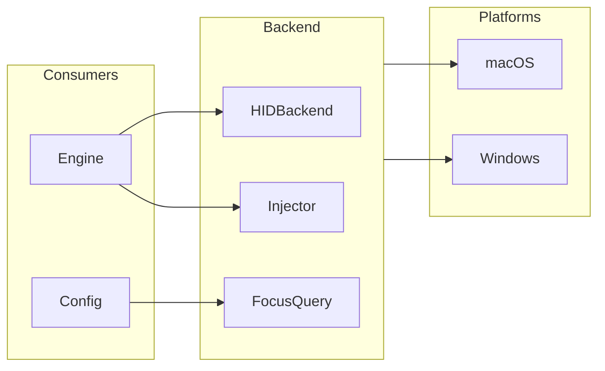

# Backend Abstraction

## Purpose

The Backend module provides an operating-system abstraction layer that isolates all
platform-specific code — HID device management, input event injection, and
foreground-application detection — behind trait interfaces. This lets the rest of
override-hub be compiled for macOS and Windows without conditional compilation
spreading through the [engine](../modules/engine.md) or CLI code.

## Key Files

| File | Role |
|---|---|
| `src/backend/mod.rs` | Root module; conditionally exposes `macos` or `windows` submodules |
| `src/backend/traits/mod.rs` | Re-exports the three core traits |
| `src/backend/traits/seize.rs` | Defines `HIDBackend` trait |
| `src/backend/traits/inject.rs` | Defines `Injector` trait |
| `src/backend/traits/focus.rs` | Defines `FocusedApp` struct and `FocusQuery` trait |
| `src/backend/macos/mod.rs` | [macOS](../modules/backend-macos.md) submodule root; re-exports `IOKitManager`, `CGEventInjector`, `NSWorkspaceFocus` |
| `src/backend/windows/mod.rs` | [Windows](../modules/backend-windows.md) submodule root; re-exports `WinHIDManager`, `SendInputInjector`, `Win32Focus` |

## Public API

### `FocusedApp` (focus.rs)

A struct carrying information about the currently foregrounded application:

```rust
#[derive(Debug, Clone)]
pub struct FocusedApp {
    /// macOS: bundle identifier (`com.apple.Safari`)
    /// Windows: executable basename (`chrome.exe`)
    pub id: String,
    /// Human-readable display name.
    pub name: String,
}
```

### `HIDBackend` trait (seize.rs)

Handles HID device seizing and polled reading:

```rust
pub trait HIDBackend {
    /// Seize the hub interfaces so the OS no longer receives original reports.
    fn seize(&mut self) -> Result<(), Error>;

    /// Poll for HID reports.
    ///
    /// Runs the platform event loop for up to `timeout_ms` milliseconds.
    /// Returns the next report if one arrived, `None` on timeout.
    fn run_once(&mut self, timeout_ms: u32) -> Result<Option<Report>, Error>;

    /// Release all held resources.
    fn release(&mut self);
}
```

- `seize()` is called once at startup to take exclusive access of the hub's HID interfaces.
- `run_once()` blocks for up to `timeout_ms` milliseconds, returning the next `Report`
  (defined in `crate::hid::Report`) or `None` on timeout.
- `release()` tears down the seized interfaces (called on exit).

**Implementations:**
- macOS: `backend::macos::seize::IOKitManager`
- Windows: `backend::windows::seize::WinHIDManager`

### `Injector` trait (inject.rs)

Injects synthetic input events into the operating system:

```rust
pub trait Injector {
    // ── Keyboard ──
    fn inject_key(&self, virtual_key: u16, down: bool) -> Result<(), Error>;
    fn inject_key_combo(&self, virtual_key: u16, modifiers: u8) -> Result<(), Error>;

    // ── Media keys (OSD) ──
    fn inject_media_key(&self, key_type: u8) -> Result<(), Error>;

    // ── System events ──
    fn inject_system_event(&self, subtype: u16, data: i32) -> Result<(), Error>;

    // ── Mouse ──
    fn inject_mouse_move(&self, dx: f64, dy: f64) -> Result<(), Error>;
    fn inject_mouse_click(
        &self, button: u8, x: Option<f64>, y: Option<f64>,
    ) -> Result<(), Error>;
    fn inject_mouse_scroll(&self, dx: f64, dy: f64) -> Result<(), Error>;
}
```

Method categories:

| Category | Methods | Purpose |
|---|---|---|
| **Keyboard** | `inject_key`, `inject_key_combo` | Press/release single keys and combinations with modifiers |
| **Media** | `inject_media_key` | System media keys (volume, play/pause, mute) that show OSD |
| **System** | `inject_system_event` | Sleep, restart, shutdown, eject |
| **Mouse** | `inject_mouse_move`, `inject_mouse_click`, `inject_mouse_scroll` | Relative cursor movement, button clicks (left/right/middle), scroll wheel |

Modifier bitmask (`inject_key_combo`): 1 = Ctrl, 2 = Shift, 4 = Alt/Option, 8 = GUI
(Cmd on macOS, Win on Windows).

**Implementations:**
- macOS: `backend::macos::inject::CGEventInjector`
- Windows: `backend::windows::inject::SendInputInjector`

### `FocusQuery` trait (focus.rs)

Retrieves the currently foregrounded application:

```rust
pub trait FocusQuery {
    /// Return the application currently in focus, or `None` if unavailable.
    fn focused_app(&self) -> Option<FocusedApp>;
}
```

**Implementations:**
- macOS: `backend::macos::focus::NSWorkspaceFocus`
- Windows: `backend::windows::focus::Win32Focus`

## Dependencies

The Backend module is the leaf of the platform-specific dependency chain. The [Engine](../modules/engine.md)
and [Config](../modules/config.md) modules depend on it (through the trait types), while the platform
submodules depend only on FFI and system libraries.



## Platform Selection

Platform selection is entirely compile-time; there is no runtime dispatch. The
`backend/mod.rs` root uses `#[cfg]` attributes:

```rust
#[cfg(target_os = "macos")]
pub mod macos;
pub mod traits;
#[cfg(target_os = "windows")]
pub mod windows;
```

Only the submodule matching the target OS is compiled, so unused platform code never
reaches the binary.

## Usage Example

The canonical instantiation site is in `src/cli.rs`. A single `#[cfg]` block creates
the three backend objects, which are then used through their trait interfaces:

```rust
#[cfg(target_os = "macos")]
let (mut seize_backend, injector, focus_query) = {
    use crate::backend::macos;
    (macos::IOKitManager::new(), macos::CGEventInjector::new(), macos::NSWorkspaceFocus::new())
};

#[cfg(target_os = "windows")]
let (mut seize_backend, injector, focus_query) = {
    use crate::backend::windows;
    (windows::WinHIDManager::new(), windows::SendInputInjector::new(), windows::Win32Focus::new())
};

seize_backend.seize()?;
```

The same pattern is duplicated in `src/ffi.rs` for the FFI-based entry point.

Within the Engine, `Injector` is consumed as a trait object (`&dyn Injector`) by the
`Dispatcher`, `KeyboardMapper`, and `Consumer` components.
