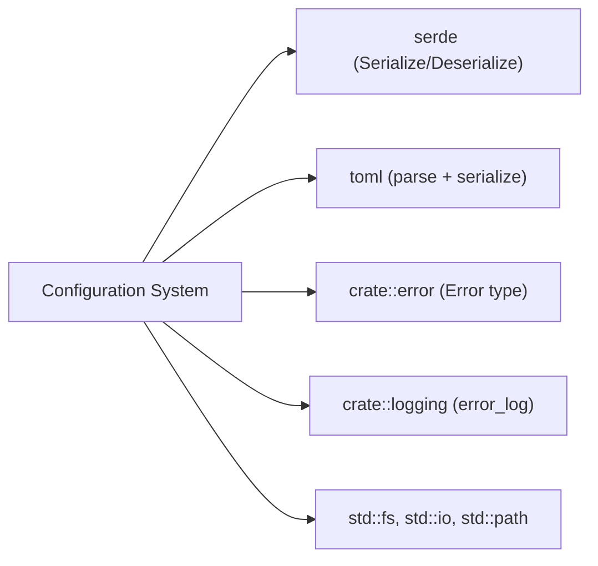

# Configuration System

## Purpose

The configuration module is the central configuration system for override-hub. It defines all data types that represent user configuration, provides documented production defaults, and implements secure loading/saving of [TOML configuration files](../config/config-toml.md). The module handles device matching criteria, hub button-to-event mappings, per-application profile overrides, and logging settings.

## Key Files

| File | Role |
|------|------|
| `src/config/mod.rs` | Module root; re-exports `Config`, `ButtonMappingSet`, `TargetEvent`; declares the [`combo`](../modules/config-combo.md) submodule |
| `src/config/types.rs` | Core data types — `Config`, `DeviceConfig`, `DeviceMatch`, `ButtonMappingSet`, `TargetEvent`, `Profile`, `LoggingConfig`; `NX_KEYTYPE_*` and `NX_SUBTYPE_*` constants |
| `src/config/defaults.rs` | Returns a TOML string containing documented production defaults with inline comments explaining every option |
| `src/config/manager.rs` | `load_or_default()` and `save()` functions with security hardening (O_NOFOLLOW, fchmod 0o600, group/world-writable rejection) |

## Public API

The module root (`mod.rs`) re-exports three core types:

```rust
pub use types::{ButtonMappingSet, Config, TargetEvent};
```

### Config

Top-level configuration struct serialized from a TOML file.

```rust
pub struct Config {
    pub device: DeviceConfig,
    pub default: ButtonMappingSet,
    pub profiles: Vec<Profile>,
    pub logging: LoggingConfig,
}
```

- **`device`** — which USB HID devices/interfaces to seize (whitelist-only).
- **`default`** — complete fallback mapping for all 8 hub controls.
- **`profiles`** — ordered list of per-application overrides; missing fields inherit from `default`.
- **`logging`** — log level selection.

### DeviceConfig & DeviceMatch

`DeviceConfig` holds a list of `DeviceMatch` entries (OR logic) that identify HID devices:

```rust
pub struct DeviceConfig {
    pub seize: Vec<DeviceMatch>,
}

pub struct DeviceMatch {
    pub vendor_id: String,     // hex string, e.g. "0x05AC"
    pub product_id: String,    // hex string, e.g. "0x029C"
    pub usage_page: Option<u16>,
    pub usage: Option<u16>,
}
```

`DeviceMatch` provides `vendor_id_u16()` and `product_id_u16()` helpers that parse hex strings into `u16`.

### ButtonMappingSet

Represents all 8 mappable controls on the hub. Each field is `Option<TargetEvent>` — in the `[default]` section all fields should be populated; in `[[profiles]]` sections, `None` fields inherit from the default.

```rust
pub struct ButtonMappingSet {
    pub button_bottom_right:      Option<TargetEvent>,
    pub button_bottom_right_hold: Option<TargetEvent>,
    pub button_top_left:          Option<TargetEvent>,
    pub button_top_left_hold:     Option<TargetEvent>,
    pub play_pause:               Option<TargetEvent>,
    pub knob_cw:                  Option<TargetEvent>,
    pub knob_ccw:                 Option<TargetEvent>,
    pub knob_click:               Option<TargetEvent>,
}
```

The `merge(&self, fallback: &ButtonMappingSet) -> ButtonMappingSet` method fills every `None` field from the fallback, producing a complete mapping set.

### TargetEvent

An enum with 6 variants, serialized with `#[serde(tag = "type")]` so each variant maps to a `type` field in TOML.

| Variant | Fields | Description |
|---------|--------|-------------|
| `Keyboard` | `binding: String`, `label: String` | Single key or modifier combo (`"Ctrl+Q"`, `"Shift+Cmd+4"`) |
| `MediaKey` | `key_type: u8`, `label: String` | macOS media key by NX_KEYTYPE value (0=Vol+, 1=Vol-, 7=Mute, 16=Play/Pause, etc.) |
| `SystemEvent` | `subtype: u16`, `data: i32`, `label: String` | System-level event (sleep, restart, shutdown, eject, brightness) |
| `MouseMove` | `dx: f64`, `dy: f64`, `label: String` | Relative mouse cursor movement |
| `MouseClick` | `button: u8`, `x: Option<f64>`, `y: Option<f64>`, `label: String` | Mouse button click (1=left, 2=right, 3=middle), optional absolute coordinates |
| `MouseScroll` | `dx: f64`, `dy: f64`, `label: String` | Scroll wheel event |

`TargetEvent::label()` returns a human-readable display string: uses the explicit `label` field if non-empty, otherwise falls back to a built-in description (e.g., `"Vol+"` for key_type 0, `"Sleep"` for subtype 11).

The `Default` implementation returns `Keyboard { binding: "", label: "" }`.

### NX_KEYTYPE and NX_SUBTYPE Constants

Defined as associated constants on `TargetEvent`:

- `SUBTYPE_POWER_KEY` (1), `SUBTYPE_EJECT_KEY` (10), `SUBTYPE_SLEEP` (11), `SUBTYPE_RESTART` (12), `SUBTYPE_SHUTDOWN` (13), `SUBTYPE_BRIGHTNESS` (53)
- `KEYTYPE_SOUND_UP` (0) through `KEYTYPE_ILLUM_TOGGLE` (23) — 22 constants total, sourced from macOS `ev_keymap.h`.

### Profile

```rust
pub struct Profile {
    pub app_id: String,
    pub app_name: String,
    pub mappings: ButtonMappingSet,
}
```

- **`app_id`** — bundle identifier (e.g., `"com.apple.Terminal"`).
- **`app_name`** — human-readable display name.
- **`mappings`** — partial overrides; `None` fields inherit from `[default]`.

### LoggingConfig

```rust
pub struct LoggingConfig {
    pub loglevel: String,  // "debug" or "info" (defaults to "info")
}
```

### Config Loading and Saving

The `manager` submodule provides two free functions:

**`load_or_default(path: &Path) -> Config`**

Opens the config file at `path`, checks permissions, parses the TOML content, and returns the parsed `Config`. If the file does not exist, is unreadable, fails to parse, or has unsafe permissions, the function falls back to built-in defaults (from `defaults.rs`) and attempts to write them to disk as a new file.

**`save(config: &Config, path: &Path) -> Result<(), Error>`**

Serializes `config` to TOML and writes it to `path` with the same security hardening as the writer used by `load_or_default`.

## Dependencies



- **Internal**: depends on [crate::error](../modules/error.md) for `Error::Config` and `Error::Io` variants; depends on `crate::logging` for `error_log` calls.
- **External**: `serde` for derive macros `Serialize`/`Deserialize`; `toml` for TOML parsing and pretty-printing; standard library for file I/O and platform-specific APIs (`std::os::unix::fs::OpenOptionsExt`, `std::os::unix::fs::MetadataExt`).
- **Sub-module**: `combo` (defined in `src/config/combo.rs`) — not covered by this page.

## Default Configuration

The `defaults::default_config_toml()` function returns a TOML string with full inline documentation. The defaults target a Hagibis USB hub (Apple VID `0x05AC`, PID `0x029C`) plus an audio chip (`0x0C76:0x1710`). Three HID interfaces are seized:

1. Hub Interface 0 — keyboard (usage page 1, usage 6)
2. Hub Interface 1 — consumer control (usage page 12, usage 1)
3. Audio chip — consumer control (usage page 12, usage 1)

Default button mappings:

| Control | Type | Target |
|---------|------|--------|
| `button_top_left` | Keyboard | `Shift+Cmd+N` |
| `button_top_left_hold` | Keyboard | `Cmd+T` |
| `button_bottom_right` | Keyboard | `Shift+Cmd+4` |
| `button_bottom_right_hold` | Keyboard | `Shift+Cmd+3` |
| `play_pause` | MediaKey | Play/Pause (key_type 16) |
| `knob_cw` | MediaKey | Vol+ (key_type 0) |
| `knob_ccw` | MediaKey | Vol- (key_type 1) |
| `knob_click` | MediaKey | Mute (key_type 7) |

The default log level is `"debug"`.

## [Security](../concepts/config-security.md)

The configuration system implements several security measures because the [engine](../modules/engine.md) runs with elevated privileges and can inject arbitrary keystrokes:

1. **Permission check on load** (`is_safe_file` on Unix): rejects any config file that is group-writable (0o020) or world-writable (0o002). A permissive config would let an unprivileged local attacker inject keystrokes into the privileged session.

2. **TOCTOU prevention**: the permission check runs via `fstat` on an already-open file descriptor, and the content is read from the same descriptor. This eliminates the time-of-check/time-of-use window where the file path could be swapped between the permission check and the read.

3. **O_NOFOLLOW on writes** (`write_config_file` on Unix): opens the file with the `O_NOFOLLOW` flag so a symlink at the config path cannot redirect the write to an arbitrary system file.

4. **Atomic permission setting**: uses `fchmod` on the open file descriptor (rather than a path-based `set_permissions` call) to set 0o600 owner-only permissions, avoiding a second TOCTOU window.

5. **Graceful fallback**: if the config file has unsafe permissions, the engine logs an error and falls back to built-in defaults without reading the untrusted file and without overwriting it.
