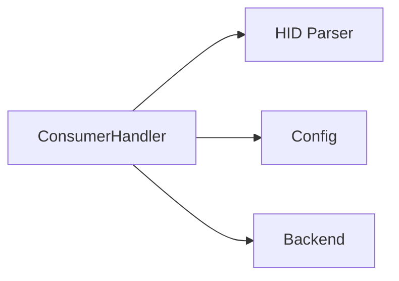

# Consumer Report Handler

## Purpose

The Consumer Report Handler processes [HID](../modules/hid.md) consumer reports (knob rotation, mute tap, play/pause) emitted by the physical hub. Its primary responsibility is **stateful edge detection**: it remembers the last-seen consumer report bits and only fires mapped events when a bit transitions from 0 to 1 (a rising edge). Without this state tracking, a held knob position or a button that stays high across consecutive USB polls would repeatedly inject events, flooding the OS with unintended input.

It works alongside the `KeyboardHandler` under the [`Dispatcher`](../modules/engine.md) — both receive the same resolved `ButtonMappingSet` on each cycle.

## Key Files

| File | Role |
|------|------|
| `src/engine/consumer.rs` | `ConsumerHandler` struct, constructor, edge detection, and fire logic. |

## Public API

### `ConsumerHandler`

Tracks the last-seen consumer bits byte (`last: u8`). Created fresh with no prior state.

```rust
// src/engine/consumer.rs

pub struct ConsumerHandler {
    last: u8,
}

impl ConsumerHandler {
    pub fn new() -> Self;

    pub fn handle(
        &mut self,
        report: &ConsumerReport,
        mapping: &ButtonMappingSet,
        injector: &dyn Injector,
    ) -> Result<(), Error>;
}
```

#### `new()`

Initialises the handler with `last = 0`, meaning no bits have been seen yet. The first report received will always produce rising edges for any set bits.

```rust
pub fn new() -> Self { Self { last: 0 } }
```

#### `handle()`

Accepts a parsed `ConsumerReport`, the resolved [`ButtonMappingSet`](../modules/config.md) for the currently focused application, and a reference to the platform injector. It compares the incoming bits against the stored `last` value, fires events for any detected rising edges, then stores the current bits as the new baseline.

```rust
pub fn handle(
    &mut self,
    report: &ConsumerReport,
    mapping: &ButtonMappingSet,
    injector: &dyn Injector,
) -> Result<(), Error>;
```

Errors from the injector are logged as warnings and swallowed — a single failed injection does not abort the rest of the handler.

### Edge Detection Helper

A private static helper implements the rising-edge check:

```rust
fn edge(prev: u8, curr: u8, mask: u8) -> bool {
    curr & mask != 0 && prev & mask == 0
}
```

Returns `true` only when the masked bit is set in `curr` but was not set in `prev`. This is the core of the repeat-prevention logic.

## State Tracking

The handler stores a single `u8` field — `last` — that holds the consumer bits from the previous `handle()` call. On each invocation:

1. The current bits are read from `report.bits.0`.
2. Four bit positions are tested with `edge(prev, curr, mask)`.
3. For any mask that produces a rising edge, the corresponding `ButtonMappingSet` field is read and, if `Some`, fired via `injector_util::fire()`.
4. After all checks, `self.last` is updated to `curr`.

### Absence of Falling Edge Handling

Only rising edges are detected. When a user releases a knob (bit goes from 1 to 0), no event fires. This is correct because:
- **Knob rotation** reports are absolute (Vol+ or Vol- is set while the knob is being turned). A CW turn sets `0x01`, a CCW turn sets `0x02`. The application receives one event per USB poll where the bit is newly set.
- **Mute tap** and **Play/Pause tap** are momentary press actions. Rising-edge detection fires exactly once per press. Holding the button does not repeat the event.

## Consumer Report Bit Mapping

The handler inspects four bits of the consumer report byte. Each bit is mapped to a single field in `ButtonMappingSet`:

| Bit mask | Consumer meaning | Mapping field | Typical use |
|----------|------------------|---------------|-------------|
| `0x01`   | Volume Up (Vol+) | `mapping.knob_cw` | Knob turned clockwise |
| `0x02`   | Volume Down (Vol-) | `mapping.knob_ccw` | Knob turned counter-clockwise |
| `0x04`   | Mute             | `mapping.knob_click` | Knob pressed (tap) |
| `0x40`   | Play/Pause       | `mapping.play_pause` | Dedicated play/pause button tap |

Bits `0x08`, `0x10`, `0x20`, and `0x80` are not handled and are silently ignored.

The mapping field may be `None` if the user has not configured an action for that physical control. In that case the rising edge is detected but no event is fired — no error is produced.

### Fire Behaviour

When a `TargetEvent` is present for the matched field, the handler calls `injector_util::fire()`, which dispatches to the appropriate `Injector` trait method:

- `TargetEvent::MediaKey { key_type }` — calls `injector.inject_media_key()`.
- `TargetEvent::Keyboard { binding }` — parses the binding string and issues key press/release sequences.
- `TargetEvent::SystemEvent { .. }` — calls `injector.inject_system_event()`.
- `TargetEvent::MouseMove { .. }` / `TargetEvent::MouseClick { .. }` / `TargetEvent::MouseScroll { .. }` — also supported, though unusual for consumer controls.

## Dependencies

The `ConsumerHandler` depends on the following crate-level subsystems:



- **HID Parser** — provides the `ConsumerReport` struct (specifically `ConsumerBits(pub u8)`) that carries the raw report byte.
- **Config** — provides `ButtonMappingSet` and `TargetEvent` types (stored in the [`config.toml`](../config/config-toml.md) file) used for mapping and event resolution.
- **[Backend](../modules/backend.md)** — provides the `Injector` trait that `injector_util::fire()` calls to dispatch events into the OS.

The handler is also coupled to `injector_util::fire()` in the same engine module for generic event execution. Errors from firing are logged as warnings but never propagated.

## Usage Example

The `ConsumerHandler` is instantiated inside the `Dispatcher` and called once per HID cycle:

```rust
// src/engine/dispatcher.rs (simplified)

let mut consumer = ConsumerHandler::new();

// In the dispatch loop:
let report: ConsumerReport = /* parsed from raw HID */;
let mapping: ButtonMappingSet = /* resolved for focused app */;

if let Err(e) = consumer.handle(&report, &mapping, &*injector) {
    // Errors are diagnostic-only; the loop continues.
    log_warn!("consumer", "handle error: {}", e);
}
```

The handler is non-blocking and stateless between cycles except for the single `last` byte. It performs no I/O, no allocation, and no fallible operations beyond the injector call.
