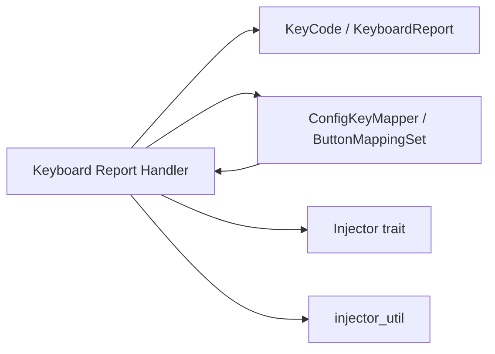

# Keyboard Report Handler

## Purpose

The `KeyboardHandler` is a stateful component that receives [HID](../modules/hid.md) keyboard reports, tracks which keys are currently pressed, and dispatches events only for newly-pressed keys. It acts as the bridge between raw USB HID keyboard input and the override-hub event system, filtering out noise (repeated press notifications for already-held keys) and resolving keycodes through the configuration layer.

## Key Files

| File | Role |
|------|------|
| `src/engine/keyboard.rs` | Stateful handler struct, HID report processing, and event dispatch |

## Public API

```rust
pub struct KeyboardHandler;

impl KeyboardHandler {
    pub fn new() -> Self;
    pub fn handle(
        &mut self,
        report: &KeyboardReport,
        mapping: &ButtonMappingSet,
        injector: &dyn Injector,
    ) -> Result<(), Error>;
}
```

- **`KeyboardHandler::new()`** — Creates a new handler with an empty pressed-keys set.
- **`KeyboardHandler::handle()`** — Processes an incoming HID keyboard report, computes the difference from the previous state, and fires events for any newly-depressed keys via the [injector](../modules/backend.md). Returns `Ok(())` on success, or an `Error` from the injector layer.

## State Tracking (HashSet Diffing)

The handler maintains a single field:

```rust
pressed: HashSet<KeyCode>
```

On every call to `handle()`, the current report's keycodes are collected into a temporary `HashSet`:

```rust
let new_keys: HashSet<KeyCode> = report.keycodes.iter().copied().collect();
```

The difference between `new_keys` and `self.pressed` is computed via `HashSet::difference()`. Only the keys that appear in the current report but were absent in the previous state are processed further:

```rust
for kc in new_keys.difference(&self.pressed) {
    // resolve and fire event for kc
}
```

After processing, `self.pressed` is replaced entirely with the new set:

```rust
self.pressed = new_keys;
```

This pure-diff approach avoids re-firing events for keys that are held across consecutive reports, which is critical since HID reports are polled at a high frequency and the same key would otherwise trigger events repeatedly.

## Press vs Release Behavior

- **Press events** — Only keys that transition from absent to present (the difference set) are dispatched. Each newly-pressed keycode is resolved through `ConfigKeyMapper::map_keycode()` against the active [`ButtonMappingSet`](../modules/config.md). If a mapping exists, the resulting event is fired via `injector_util::fire()`.

- **Release events** — The handler implicitly tracks release by replacing `self.pressed` with the current report's key set. If a key was in the previous set but is absent in the current report, it simply falls out of the difference calculation and is *not* processed as an event. Release-only handling is explicitly ignored at this layer.

- **Error handling** — Individual fire errors are logged as warnings (via `log_warn!`) but do not halt processing of remaining keys. This keeps a single misconfigured or failing binding from blocking all subsequent key events.

## Dependencies



- **Internal**: Relies on `hid::KeyCode`, `hid::KeyboardReport`, `engine::key_mapper::ConfigKeyMapper`, `config::ButtonMappingSet` (defined in [`config.toml`](../config/config-toml.md)), `backend::Injector`, and `engine::injector_util`.
- **External**: `std::collections::HashSet` for state tracking.

## Usage Example

The handler is called from the [engine](../modules/engine.md)'s main event loop with each new HID keyboard report:

```rust
let mut keyboard_handler = KeyboardHandler::new();

// On each keyboard report received from the HID layer:
keyboard_handler.handle(&report, &mapping_set, &injector)?;
```
