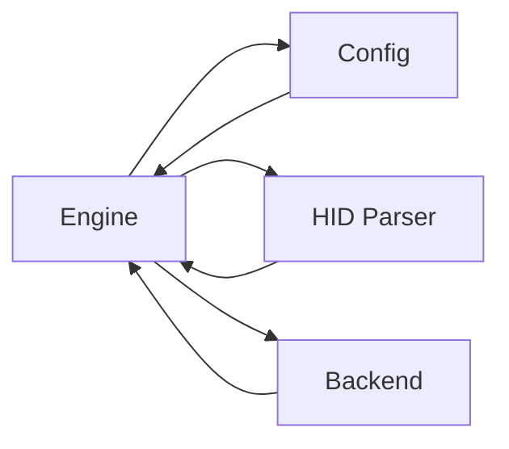

# Core Event Engine

## Purpose

The Core Event Engine is the central event processing layer. It sits between the [HID parser](../modules/hid.md) (which produces raw `Report` values from USB packets) and the platform-specific [backend injector](../modules/backend.md) (which dispatches keystrokes, media keys, and mouse events into the operating system). Its responsibilities are:

1. **Keycode resolution** — Map physical hub buttons (`BTN_TOP_LEFT`, `BTN_BOTTOM_RIGHT`, etc.) to configured `TargetEvent` values, respecting per-application profile overrides.
2. **State tracking** — Track which keys are currently pressed ([`KeyboardHandler`](../modules/engine-keyboard.md)) and which consumer bits have been seen ([`ConsumerHandler`](../modules/engine-consumer.md)) so that events fire only on meaningful transitions (press, not repeat).
3. **Event injection** — Execute the resolved `TargetEvent` via the `Injector` trait, abstracting over macOS and Windows backends.

The engine has no knowledge of USB HID protocol details and no dependency on any GUI framework — it operates purely on the parsed `Report` enum and the [`Config`](../modules/config.md) struct.

## Key Files

| File | Role |
|------|------|
| `src/engine/mod.rs` | Module root; declares sub-modules and re-exports `Dispatcher`. |
| `src/engine/dispatcher.rs` | Top-level `Dispatcher` struct that routes `Report` variants to the correct handler. |
| `src/engine/key_mapper.rs` | `ConfigKeyMapper` — resolves the active `ButtonMappingSet` for the focused application and maps individual `KeyCode` values to `TargetEvent`. |
| `src/engine/injector_util.rs` | `fire()` — generic executor that takes a `TargetEvent` and calls the appropriate `Injector` method. |
| `src/engine/keyboard.rs` | `KeyboardHandler` — tracks currently pressed keycodes, fires events for newly pressed hub buttons. |
| `src/engine/consumer.rs` | `ConsumerHandler` — tracks consumer report state, fires events on rising edges (knob turns, play/pause taps). |

## Public API

### `Dispatcher`

The main entry point. Created directly (no builder) and called once per parsed HID report.

```rust
// src/engine/dispatcher.rs

pub struct Dispatcher {
    keyboard: KeyboardHandler,
    consumer: ConsumerHandler,
}

impl Dispatcher {
    pub fn new() -> Self;

    pub fn dispatch(
        &mut self,
        report: &Report,
        config: &Config,
        focused_app_id: Option<&str>,
        injector: &dyn Injector,
    ) -> Result<(), Error>;
}
```

`dispatch()` matches on the `Report` enum:
- `Report::Keyboard(kb)` — delegates to `KeyboardHandler::handle()`.
- `Report::Consumer(c)` — delegates to `ConsumerHandler::handle()`.
- All other variants (`MediaKeys`, `Vendor`, `Unknown`) are silently ignored.

Before dispatching, it calls `ConfigKeyMapper::resolve()` once to obtain the `ButtonMappingSet` for the active app; the same mapping is shared by both handlers in a single cycle.

### `ConfigKeyMapper`

Stateless utility with two static methods. No instance is ever created.

```rust
// src/engine/key_mapper.rs

impl ConfigKeyMapper {
    /// Return the ButtonMappingSet that applies for the given focused app.
    /// Iterates config.profiles in order; the first match wins and is
    /// merged onto config.default (missing fields inherit defaults).
    pub fn resolve(config: &Config, focused_app_id: Option<&str>) -> ButtonMappingSet;

    /// Map a hub KeyCode to its TargetEvent using the resolved mapping.
    /// Returns None for unrecognised keycodes.
    pub fn map_keycode(kc: KeyCode, mapping: &ButtonMappingSet) -> Option<&TargetEvent>;
}
```

`resolve()` logic:
- If `focused_app_id` is `Some(id)`, iterate `config.profiles` and return the first profile whose `app_id` matches, merged onto `config.default` via `ButtonMappingSet::merge()`.
- If no match (or `focused_app_id` is `None`), return `config.default` as-is.

`map_keycode()` matches on the four hub button keycodes:

| KeyCode | Mapping field |
|---------|---------------|
| `KeyCode::BTN_TOP_LEFT` | `mapping.button_top_left` |
| `KeyCode::BTN_TOP_LEFT_HOLD` | `mapping.button_top_left_hold` |
| `KeyCode::BTN_BOTTOM_RIGHT` | `mapping.button_bottom_right` |
| `KeyCode::BTN_BOTTOM_RIGHT_HOLD` | `mapping.button_bottom_right_hold` |

All other `KeyCode` values return `None`.

### `fire()`

Generic event executor. Called by both `KeyboardHandler` and `ConsumerHandler` after mapping.

```rust
// src/engine/injector_util.rs

pub fn fire(event: &TargetEvent, injector: &dyn Injector) -> Result<(), Error>;
```

Dispatches on each `TargetEvent` variant:

| Variant | Injector call |
|---------|---------------|
| `TargetEvent::Keyboard { binding }` | Parses `binding` via [`combo::parse_combo()`](../modules/config-combo.md), then either `inject_key_combo(vk, mods)` (if modifiers present) or `inject_key(vk, true)` / `inject_key(vk, false)` for a plain press-and-release. |
| `TargetEvent::MediaKey { key_type }` | `inject_media_key(key_type)` |
| `TargetEvent::SystemEvent { subtype, data }` | `inject_system_event(subtype, data)` |
| `TargetEvent::MouseMove { dx, dy }` | `inject_mouse_move(dx, dy)` |
| `TargetEvent::MouseClick { button, x, y }` | `inject_mouse_click(button, x, y)` |
| `TargetEvent::MouseScroll { dx, dy }` | `inject_mouse_scroll(dx, dy)` |

On parse failure for a `Keyboard` event, returns [`Error::Config`](../modules/error.md) with the invalid binding string.

### `KeyboardHandler`

Tracks the set of currently pressed `KeyCode` values. On each `handle()` call it diffs the incoming report against the previous set and only fires events for newly pressed keys (avoids repeat injection while a button is held).

```rust
// src/engine/keyboard.rs (implied, not re-exported at crate level)

pub struct KeyboardHandler { /* HashSet<KeyCode> */ }

impl KeyboardHandler {
    pub fn new() -> Self;
    pub fn handle(
        &mut self,
        report: &KeyboardReport,
        mapping: &ButtonMappingSet,
        injector: &dyn Injector,
    ) -> Result<(), Error>;
}
```

### `ConsumerHandler`

Tracks the last-seen consumer bits byte. On each `handle()` call it detects rising edges (0→1 transitions) on four bit positions:

| Bit mask | Mapping field |
|----------|---------------|
| `0x01` (Vol+) | `mapping.knob_cw` |
| `0x02` (Vol-) | `mapping.knob_ccw` |
| `0x04` (Mute) | `mapping.knob_click` |
| `0x40` (Play/Pause) | `mapping.play_pause` |

Only rising edges fire. A bit that stays high across consecutive reports does not re-trigger.

```rust
// src/engine/consumer.rs (implied, not re-exported at crate level)

pub struct ConsumerHandler { /* last: u8 */ }

impl ConsumerHandler {
    pub fn new() -> Self;
    pub fn handle(
        &mut self,
        report: &ConsumerReport,
        mapping: &ButtonMappingSet,
        injector: &dyn Injector,
    ) -> Result<(), Error>;
}
```

## Dependencies

The engine depends on three crate-level subsystems described by the following module relationships:



- **Engine → Config** — reads `Config` (default `ButtonMappingSet`, `profiles` list) and `TargetEvent`/`ButtonMappingSet` data types to perform resolution and mapping.
- **Engine → HID** — consumes `Report`, `KeyCode`, `KeyboardReport`, `ConsumerReport` types from the HID parser as input.
- **Engine → Backend** — calls `Injector` trait methods and (indirectly through the dispatch caller) uses `FocusQuery` to obtain the foreground app ID.

The reverse edges indicate that these modules define types the engine depends on; the engine itself is only consumed by the top-level main loop that calls `Dispatcher::dispatch()` in a cycle.

## Usage Example

The engine is used from the main application loop. After a HID report is parsed from raw USB data, the `Dispatcher` routes it through the mapping pipeline using the [`config.toml`](../config/config-toml.md) file:

```rust
// Hypothetical main loop — not in the engine module itself.

let mut dispatcher = Dispatcher::new();
let config = Config::load("config.toml").unwrap();
let focus_query = SomeBackend::focus_query();
let injector = SomeBackend::injector();

loop {
    // 1. Read raw HID data from the seized device
    let raw_report = device.read_report().unwrap();

    // 2. Parse into a typed Report
    let report = hid::parser::parse(&raw_report).unwrap();

    // 3. Query the foreground application
    let focused_app_id = focus_query
        .focused_app()
        .map(|app| app.id);

    // 4. Dispatch: resolve mapping, track state, fire events
    dispatcher.dispatch(&report, &config, focused_app_id.as_deref(), &*injector).unwrap();
}
```

This same pattern applies on any platform. The `ConfigKeyMapper::resolve()` call is made internally by `dispatch()` using the `focused_app_id` parameter; callers only need to provide it.
