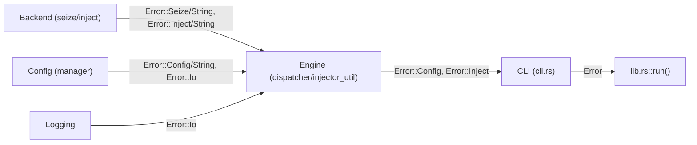

# Error Handling

## Purpose

The `error` module defines a single `Error` enum that serves as the unified error type for the entire application. Every module — [backend](../modules/backend.md), [engine](../modules/engine.md), [config](../modules/config.md), logging, and [CLI](../modules/cli.md) — returns `Result<_, Error>`, ensuring that callers at every level can propagate, match on, or display errors with a consistent interface. The module does **not** depend on the `thiserror` crate; `Display` and `From` are implemented manually.

## Key Files

| File | Role |
|------|------|
| `src/error.rs` | `Error` enum definition, `Display` impl, `From<std::io::Error>` conversion |

## Public API

### `Error` enum

```rust
#[derive(Debug)]
pub enum Error {
    Seize(String),    // IOKit / Win32 HID seizing failed
    Inject(String),   // CGEvent / SendInput injection failed
    Config(String),   // Config file error (parse, read, write)
    Io(std::io::Error), // I/O error (file system)
    Other(String),    // Generic runtime error
}
```

### `Display` implementation

Each variant formats a human-readable message prefixing the inner detail:

| Variant | Display output |
|---------|---------------|
| `Seize` | `seize error: {msg}` |
| `Inject` | `inject error: {msg}` |
| `Config` | `config error: {msg}` |
| `Io` | `io error: {e}` |
| `Other` | `{msg}` (passthrough, no prefix) |

### `From<std::io::Error>`

```rust
impl From<std::io::Error> for Error {
    fn from(e: std::io::Error) -> Self { Error::Io(e) }
}
```

Enables the `?` operator on any `std::io::Result` inside a function returning `Result<_, Error>`.

### Tests

Four unit tests verify correctness:

- `error_display_seize` — checks that `Seize` messages contain both the prefix and the detail string.
- `error_display_config` — checks exact output for `Config` errors.
- `error_display_io` — checks that `Io` errors include the `io error:` prefix.
- `error_from_io` — verifies that `std::io::Error` converts into `Error::Io` via the `From` impl.

## Error Flow

Errors propagate through three layers:



1. **Backend layer** — `Seize` traits and `Inject` traits return `Result<(), Error>`. Platform-specific implementations (macOS IOKit/CGEvent, Windows Win32/SendInput) construct `Error::Seize` with descriptive strings when device acquisition fails, or `Error::Inject` when key/mouse event creation fails.

2. **Config layer** — `manager::save` returns `Result<(), Error>`, wrapping TOML serialization errors in `Error::Config` and file-write errors in `Error::Io`. The `load_or_default` function does **not** return `Error` — it falls back to built-in defaults and prints to stderr on failure.

3. **Engine layer** — `Dispatcher::dispatch`, `KeyboardHandler::handle`, `ConsumerHandler::handle`, and `injector_util::fire` all return `Result<(), Error>`. However, engine handlers typically do **not** propagate injection errors upward — they log the error via `log_warn!` and continue, converting them to non-fatal warnings:

   ```rust
   // keyboard.rs
   if let Err(e) = injector_util::fire(event, injector) {
       log_warn!("keyboard", "fire error for {:?}: {}", kc, e);
   }
   ```

   ```rust
   // consumer.rs
   if let Err(e) = injector_util::fire(event, injector) {
       log_warn!("consumer", "knob_cw fire error: {}", e);
   }
   ```

4. **CLI layer** — `cli::run()` returns `Result<(), Error>`. It uses `?` on fatal operations (seize startup, logging init, config save) and logs non-fatal dispatch errors with `log_warn!`. The library entry point `lib.rs::run()` delegates directly to `cli::run()`.

## Usage Example

```rust
// src/error.rs — manual Display impl
impl std::fmt::Display for Error {
    fn fmt(&self, f: &mut std::fmt::Formatter<'_>) -> std::fmt::Result {
        match self {
            Error::Seize(msg)  => write!(f, "seize error: {}", msg),
            Error::Inject(msg) => write!(f, "inject error: {}", msg),
            Error::Config(msg) => write!(f, "config error: {}", msg),
            Error::Io(e)       => write!(f, "io error: {}", e),
            Error::Other(msg)  => write!(f, "{}", msg),
        }
    }
}
```

```rust
// src/config/manager.rs — constructing an Error
pub fn save(config: &Config, path: &Path) -> Result<(), Error> {
    let toml_str = toml::to_string_pretty(config)
        .map_err(|e| Error::Config(e.to_string()))?;
    write_config_file(path, &toml_str).map_err(Error::Io)?;
    Ok(())
}
```

```rust
// src/cli.rs — top-level error propagation
pub fn run() -> Result<(), Error> {
    crate::logging::init(level, log_dir())?;
    seize_backend.seize()?;
    // ...
    dispatcher.dispatch(&report, &cfg, app_id, &injector)?;
    // ...
    Ok(())
}
```
