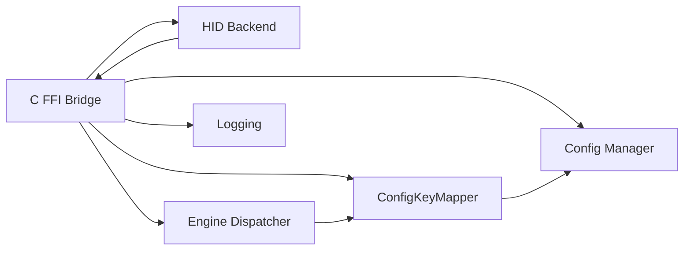

# C FFI Bridge

## Purpose

The C FFI Bridge provides a stable C ABI that the [macOS Swift GUI](../components/swift-gui.md) (or any other language supporting C interop) uses to start, stop, query, and configure the Override Hub [engine](../modules/engine.md). It encapsulates all Rust-internal types behind opaque handles and exposes the engine lifecycle, config management, and real-time status as simple `extern "C"` functions.

## Key Files

| File | Role |
|------|------|
| `src/ffi.rs` | All exported C functions, global statics, lock helpers, and platform-specific utilities |

## Global Statics

| Static | Type | Description |
|--------|------|-------------|
| `ENGINE` | `Mutex<Option<Engine>>` | Holds the running engine handle (thread join handle + stop/finished signals) |
| `CONFIG` | `Mutex<Option<Config>>` | Live configuration; the engine thread reads this every poll cycle so reloads take effect immediately |
| `STATUS` | `Mutex<Status>` | Real-time engine status structure serialised as JSON for the GUI |

The `Status` struct (line 76) carries all live state visible to the GUI:

| Field | Type | Description |
|-------|------|-------------|
| `running` | `bool` | Whether the engine loop is active |
| `seized` | `bool` | Whether the HID device has been seized |
| `consumer` | `u8` | Last consumer control HID report bits |
| `consumer_sticky` | `u8` | Sticky copy of last non-zero consumer value |
| `consumer_hold` | `u32` | Hold-down counter before sticky resets |
| `keyboard_keys` | `Vec<u8>` | Currently pressed key codes |
| `keyboard_modifiers` | `u8` | Current modifier mask |
| `focused_app_id` | `String` | Bundle identifier of the focused application |
| `focused_app_name` | `String` | Display name of the focused application |
| `btn_tl` / `btn_tl_hold` | `String` | Label for the top-left button (tap / hold) |
| `btn_br` / `btn_br_hold` | `String` | Label for the bottom-right button (tap / hold) |
| `knob_cw` / `knob_ccw` | `String` | Labels for knob clockwise / counter-clockwise |
| `knob_click` | `String` | Label for knob press |
| `play_pause` | `String` | Label for play/pause action |
| `engine_present` | `bool` | Whether the HID device was detected by the backend |
| `error` | `String` | Latest error message (cleared on successful cycles) |

The `Engine` struct (line 45) bundles:

| Field | Type | Description |
|-------|------|-------------|
| `thread` | `JoinHandle<()>` | The spawned engine thread |
| `stop_flag` | `Arc<AtomicBool>` | Signal flag to request engine stop |
| `finished` | `Arc<AtomicBool>` | Flag set to true after the engine thread exits |

## Public API

All exported functions use `#[unsafe(no_mangle)] pub extern "C"` and are prefixed with `hagibis_` to produce unique, collision-free C symbols.

### `hagibis_start() -> i32`

Starts the engine in a background thread. Returns `0` on success, `-1` on failure.

- Creates the config directory at `~/Library/Application Support/override-hub`
- Loads or creates a default [config](../modules/config.md) from `config.toml`
- Initialises logging to `~/Library/Logs/override-hub`
- Stores the loaded config in the `CONFIG` global
- Spawns a thread that runs `engine_loop()` — a two-phase loop that alternates between **SEEKING** (trying to seize the HID device) and **ACTIVE** (dispatching HID reports through `Dispatcher`)
- If the engine was previously started but its thread has finished (panic or stop), joins the old thread before starting fresh
- Returns `0` immediately if the engine is already running

### `hagibis_stop()`

Stops the engine and releases the HID device.

- Sets the `stop_flag` to `true`
- Joins the engine thread, blocking until it exits
- Takes the `Engine` out of the `ENGINE` global

### `hagibis_status_json(buf: *mut c_char, buf_size: i32) -> i32`

Writes the current engine status as a JSON string into the provided buffer.

- Returns the number of bytes written (excluding the null terminator)
- Returns `0` if the buffer is null or too small
- The JSON is produced by `serde_json::to_string` on a clone of the `Status` struct

### `hagibis_config_json(buf: *mut c_char, buf_size: i32) -> i32`

Writes the live configuration as a JSON string into the provided buffer.

- Returns the number of bytes written
- Returns `0` if the buffer is null or too small
- If `CONFIG` is `None`, loads the config from disk first using `manager::load_or_default`

### `hagibis_reload_config() -> i32`

Reloads the configuration from disk into the live `CONFIG` global. Returns `0` on success, `-1` on failure.

- The engine picks up changes immediately on its next poll cycle — no restart required

### `hagibis_save_config_json(json_ptr: *const c_char) -> i32`

Saves a new configuration from a JSON C string. Returns `0` on success, `-1` on failure.

- Parses the JSON string via `serde_json::from_str` into a `Config`
- Persists to `config.toml` via `manager::save`
- Updates the live `CONFIG` global so the engine sees changes instantly without restart
- Logs parse/save errors and returns `-1`

### `hagibis_is_running() -> i32`

Returns `1` if the engine thread is alive and not finished, `0` otherwise.

### `hagibis_log(level: i32, cat_ptr: *const c_char, msg_ptr: *const c_char)`

Logs a message into the engine's log file from native GUI code.

- `level`: `0`=Error, `1`=Warn, `2`=Info, `3`=Debug (anything else is treated as Debug)
- `cat_ptr`: null-terminated C string for the log category
- `msg_ptr`: null-terminated C string for the log message
- Silently returns if either pointer is null

## Thread Safety and [Panic Safety](../concepts/anti-zombie.md)

### `ffi_guard` — catch_unwind at the FFI Boundary

Every exported function wraps its implementation in `ffi_guard()` (line 65):

```rust
fn ffi_guard<T>(default: T, f: impl FnOnce() -> T) -> T {
    match std::panic::catch_unwind(std::panic::AssertUnwindSafe(f)) {
        Ok(v) => v,
        Err(_) => {
            logging::error_log("ffi", "panic caught at FFI boundary");
            default
        }
    }
}
```

If the inner function panics, the panic is caught, an error is logged, and a safe default value is returned. This prevents unwinding across the C ABI, which would be undefined behaviour.

### Poison-Tolerant Lock Helpers

Three helper functions (lines 53–63) acquire mutexes and recover from poisoned states by calling `into_inner()`:

```rust
fn status() -> std::sync::MutexGuard<'static, Status> {
    STATUS.lock().unwrap_or_else(|e| e.into_inner())
}
```

If a thread panics while holding the lock, the mutex is poisoned. Instead of propagating the panic, the helpers extract the inner value and continue, ensuring the FFI bridge never fails due to lock poisoning.

## `real_home()` Utility

On [macOS](../modules/backend-macos.md) the engine may run as root (launched via a privileged helper). The `real_home()` function (line 120) resolves the original user's home directory:

1. If the process is **not** running as root (`geteuid() != 0`), returns `$HOME` directly.
2. If running as root, reads the owner UID of `/dev/console` (the physical console device).
3. Looks up that UID via `getpwuid_r()` to obtain the user's home directory.
4. Falls back to `$HOME` if all else fails.

On non-macOS platforms, `real_home()` simply returns `$HOME` or `"."` as a fallback.

This home directory is used to derive two paths:

| Path | Derived From | Purpose |
|------|-------------|---------|
| `config_dir()` | `real_home() + "/Library/Application Support/override-hub"` | Config file location |
| `log_dir()` | `real_home() + "/Library/Logs/override-hub"` | Log file location |

## Engine Lifecycle

The `engine_loop()` (line 260) implements a two-phase state machine inside a spawn-able closure:

- **SEEKING phase**: Continuously attempts to seize the HID device via `seize_backend.seize()`. On failure, logs the error and retries every 500 ms. The status reflects `engine_present = true` with the error message, and `running = false`.
- **ACTIVE phase**: After a successful seize, creates a `Dispatcher` and polls the device with `run_once(50)` (50 ms interval). Each report is dispatched through `Dispatcher::dispatch()`, which resolves the active mapping via `ConfigKeyMapper::resolve()` against the currently focused application. If the device is unplugged or `run_once` returns an error, falls back to SEEKING.

The loop checks the `stop_flag` atomically before every iteration and on each phase boundary, ensuring prompt shutdown.

## Usage Example

A Swift GUI would call these functions through a C bridge header:

```c
// Bridging header (generated by cbindgen or handwritten)
int hagibis_start(void);
void hagibis_stop(void);
int hagibis_is_running(void);
int hagibis_status_json(char *buf, int buf_size);
int hagibis_config_json(char *buf, int buf_size);
int hagibis_reload_config(void);
int hagibis_save_config_json(const char *json);
void hagibis_log(int level, const char *cat, const char *msg);
```

```swift
let result = hagibis_start()
if result == 0 {
    let status = pollStatus()
    // update UI from status JSON
}
```

## Dependencies



- Internal: HID Backend, Config Manager, Engine Dispatcher, `ConfigKeyMapper`, Logging
- External: `serde_json` (JSON serialisation for status/config), `libc` (via raw FFI for `geteuid` / `getpwuid_r` on macOS)
