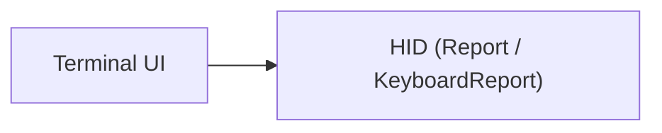

# Terminal UI

## Purpose

The TUI module renders the current [HID](../modules/hid.md) report state — consumer (media/knob) and keyboard reports — to the terminal in real time. It uses raw ANSI escape sequences (no external terminal library like `crossterm` or `termion`) to draw a box-drawing UI that updates every [engine](../modules/engine.md) poll cycle. This gives the operator a live view of which HID buttons are active, which modifiers are held, and which application currently has focus.

The design mirrors the Python `monitor.py` proof of concept that preceded the Rust implementation.

## Key Files

| File | Role |
|------|------|
| `src/tui.rs` | `TuiState` struct, ANSI constants, rendering helpers |

## Dependencies



- Internal: depends on `crate::hid` for the `Report` and `KeyboardReport` types used in `TuiState::update()`.
- External: none — all rendering is done via inline ANSI escape strings.

## Public API

### Struct: `TuiState`

Holds all data needed to render one frame of the terminal UI. Updated each poll cycle from a parsed `Report` and written to stderr/stdout via `render()`.

#### Fields

| Field | Type | Description |
|-------|------|-------------|
| `consumer` | `u8` | Bitmask of active consumer (media/knob) controls. See bit mapping below. |
| `keyboard` | `Option<KeyboardReport>` | The latest keyboard report, if one has been received. |
| `seized` | `bool` | Whether the input device is currently seized (remapping active) vs. passive monitoring. |
| `focused` | `String` | Name of the focused application. Empty string means none or unknown. |
| `btn_tl` | `String` | Binding label for the top-left physical button. |
| `btn_tl_hold` | `String` | Binding label for the top-left button long-press / hold action. |
| `btn_br` | `String` | Binding label for the bottom-right physical button. |
| `btn_br_hold` | `String` | Binding label for the bottom-right button long-press / hold action. |
| `knob_cw` | `String` | Binding label for clockwise knob rotation. |
| `knob_ccw` | `String` | Binding label for counter-clockwise knob rotation. |
| `knob_click` | `String` | Binding label for knob press (click). |
| `play_pause` | `String` | Binding label for the play/pause media action. |

#### Consumer Bit Mapping

The `consumer` field encodes which media/knob controls are active:

| Bit | Mask | Control |
|-----|------|---------|
| 0 | `0x01` | Volume Up |
| 1 | `0x02` | Volume Down |
| 2 | `0x04` | Mute |
| 6 | `0x40` | Play/Pause |

#### Methods

**`TuiState::new() -> Self`**

Creates a default `TuiState` with all fields zeroed or set to `"?"` for binding labels, and `focused` set to an empty string.

**`TuiState::update(&mut self, report: &Report)`**

Updates the internal state from a parsed HID report:
- On `Report::Consumer(c)`: copies `c.bits.0` into `self.consumer`.
- On `Report::Keyboard(kb)`: stores a clone of the keyboard report.
- All other report variants are ignored.

**`TuiState::render(&self) -> String`**

Builds the full ANSI-escaped output string for one frame. The caller writes this string to the terminal (stderr). The returned string includes:
- Screen clear and cursor home sequences.
- A box-drawing border frame with cyan-colored corners and edges.
- Each content section as rows within the frame.

#### Free Functions

| Function | Signature | Purpose |
|----------|-----------|---------|
| `modifier_string` | `fn(mod_byte: u8) -> String` | Converts a keyboard modifier byte into a human-readable string using Unicode symbols (⌃ ⇧ ⌥ ⌘). Supports both left and right variants. |
| `visual_width` | `fn(s: &str) -> usize` | Counts printable characters in a string, ignoring ANSI escape sequences (`\x1b[...m`). |
| `inner_pad` | `fn(s: &str, target_width: usize) -> String` | Pads or truncates a string to a target visual width, preserving ANSI escape sequences intact. |

#### ANSI Constants

| Constant | Value | Purpose |
|----------|-------|---------|
| `CLEAR` | `\x1b[2J` | Clear entire screen |
| `HOME` | `\x1b[H` | Move cursor to home position (1,1) |
| `HIDE` | `\x1b[?25l` | Hide cursor |
| `SHOW` | `\x1b[?25h` | Show cursor |
| `GREEN` | `\x1b[1;32m` | Bold green foreground |
| `DIM` | `\x1b[2;37m` | Dim white foreground |
| `CYAN` | `\x1b[1;36m` | Bold cyan foreground |
| `RESET` | `\x1b[0m` | Reset all attributes |

## Render Output Layout

The `render()` method produces a framed terminal display with the following sections:

### Frame

The entire UI is enclosed in a box drawn with Unicode box-drawing characters (`┌ ┐ └ ┘ │ ├ ┤`), rendered in cyan. The inner content width is 66 characters (68 including the vertical borders and padding).

### Header

A top border line containing the centered title `" HAGIBIS HUB MAPPER "`.

### Focused App Line

Displays the currently focused application name (or `"none"` if empty), followed by the exit hint `"Ctrl+C to exit"`.

### Separator

A horizontal rule (`─` repeated) drawn between sections.

### Knob & Media Section

Labeled `"[Knob & Media]  Consumer reports"`. Shows three indicators:
- **Knob**: Volume Up (`●`), Volume Down (`●`), Mute (`●`) — each rendered as a green dot when active or a dim circle (`○`) when inactive.
- **Media**: Play/Pause (`●`).

### Keyboard Buttons Section

Labeled `"[Keyboard Buttons]  Physical state"`. Displays two rows of binding labels alongside their active state:

```
  ● <btn_tl label>       ● <btn_tl_hold label>
  ● <btn_br label>       ● <btn_br_hold label>
```

Active status is determined by checking whether specific USB HID keycodes are present in the current `KeyboardReport`:
- `0x14` — top-left button (pro key)
- `0x0F` — top-left hold (consumer / mute)
- `0x20` — bottom-right button (bottom-right key)
- `0x46` — bottom-right hold (keyboard lock)

### Modifier Flags

If a keyboard report is available, a line shows the active modifier keys using Unicode symbols:
- `⌃` — Left Control (bit 0)
- `⇧` — Left Shift (bit 1)
- `⌥` — Left Option/Alt (bit 2)
- `⌘` — Left Command (bit 3)
- `⌃R` — Right Control (bit 4)
- `⇧R` — Right Shift (bit 5)
- `⌥R` — Right Option/Alt (bit 6)
- `⌘R` — Right Command (bit 7)

If no modifiers are active, an em-dash (`—`) is displayed.

### Fill Lines

Five empty rows pad the display to a consistent height.

### Footer

The bottom border is drawn, followed by a status line showing:
- `● active` / `○ inactive` legend in green and dim white.
- Current status: `"SEIZED — remapping active"` (in green) if `seized` is true, or `"monitoring (passive)"` otherwise.

## Terminal Management

The TUI does not manage terminal state itself — that is the [CLI](../modules/cli.md)'s responsibility. The module exports `HIDE`, `SHOW`, and `RESET` constants for this purpose.

Typical usage sequence:

1. **Enter alternate screen**: Write the `\x1b[?1049h` sequence (not in this module).
2. **Hide cursor**: Write `TuiState::HIDE` (`\x1b[?25l`).
3. **Enable raw mode**: Use platform-specific calls (e.g., `tcsetattr` on Linux/macOS) to disable line buffering and echo.
4. **Render loop**: Call `TuiState::render()` on each poll cycle and write the result.
5. **Restore on exit**: Show cursor, leave alternate screen, restore terminal attributes.

The original codebase renders to stderr (file descriptor 2), leaving stdout free for other output.

## Usage Example

```rust
use crate::tui::TuiState;
use crate::hid::Report;

let mut tui = TuiState::new();

// In poll loop:
for report in reports {
    tui.update(&report);
    let output = tui.render();
    // write output to stderr
    use std::io::Write;
    let stderr = std::io::stderr();
    let mut handle = stderr.lock();
    write!(handle, "{}", output).ok();
}
```
