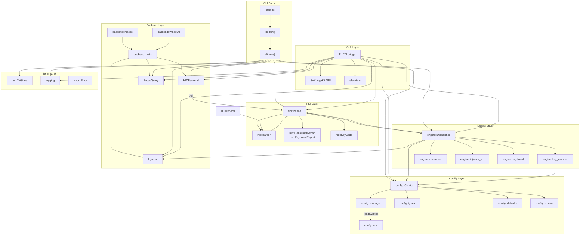

# Override Hub

Override Hub is a cross-platform Rust application that takes exclusive control of a **Hagibis UC-1102AG** USB-C hub's physical inputs (two configurable buttons, a rotary knob with push-to-click, and a Play/Pause button) and remaps them to arbitrary keyboard shortcuts, media keys, and mouse gestures. It supports per-application profiles so different programs can have different mappings, and ships with both a [macOS menu-bar GUI (Swift/AppKit)](../components/swift-gui.md) and a [terminal TUI](../modules/tui.md) for monitoring and configuration.

## Key Features

- **Seize and remap** — Takes exclusive [HID](../modules/hid.md) control of the hub's physical controls (2 buttons, rotary knob, Play/Pause) away from the OS and reinterprets every input.
- **Per-app profiles** — Different key mappings for different foreground applications, resolved automatically based on the focused window.
- **[macOS menu-bar GUI](../components/swift-gui.md)** — Native Swift/AppKit application with a live monitor overlay showing current HID state and an inline editor for mappings.
- **[CLI](../modules/cli.md) + [TUI](../modules/tui.md)** — Terminal interface built with ANSI escape codes that renders real-time [HID report](../concepts/hid-protocol.md) state and binding labels; suitable for remote monitoring or headless environments.
- **[C FFI bridge](../modules/ffi.md)** — Exposes the Rust engine to foreign language frontends via `extern "C"` functions (`hagibis_start`, `hagibis_stop`, `hagibis_status_json`, `hagibis_config_json`, `hagibis_save_config_json`, `hagibis_reload_config`).
- **[Platform-specific backends](../modules/backend.md)** — Uses IOKit + CoreGraphics on macOS and RawInput + SendInput on Windows, both abstracted behind a shared trait interface.
- **[TOML configuration](../modules/config.md)** — [Config file](../config/config-toml.md) generated on first run, hot-reloadable without restarting the device seizure.
- **[Safe unwinding](../concepts/anti-zombie.md)** — Explicit `panic = "unwind"` across all profiles to guarantee device release via Drop on panic.

## Tech Stack

| Layer | Technology |
|-------|-----------|
| Language | Rust (edition 2024) |
| Build system | Cargo + GNU autotools (`configure` + `make`) |
| Serialization | serde, serde_json, toml |
| Signal handling | ctrlc |
| macOS HID seize | IOKit (`IOKitManager`) |
| macOS key injection | CoreGraphics (`CGEventInjector`) |
| macOS focus detection | NSWorkspace (`NSWorkspaceFocus`) |
| macOS FFI helpers | Objective-C (`nsevent_helper.m`) |
| Windows HID seize | RawInput (`WinHIDManager`) |
| Windows key injection | SendInput (`SendInputInjector`) |
| Windows focus detection | Win32 API (`Win32Focus`) |
| macOS GUI | Swift / AppKit |
| Privilege elevation | C (`elevate.c`) with AuthorizationExecuteWithPrivileges |

## System Overview

The diagram above shows the layered architecture: the **[CLI](../modules/cli.md)** (`cli::run`) and **[FFI bridge](../modules/ffi.md)** (`ffi.rs`) are the two entry points. Both load the **[Config layer](../modules/config.md)** (TOML-based), instantiate the **[Backend](../modules/backend.md)** (platform-specific seize, inject, focus traits), and run the **[Engine](../modules/engine.md)** (report dispatching and key mapping). The **[HID layer](../modules/hid.md)** parses [raw USB reports](../concepts/hid-protocol.md) into typed structs. The **[GUI](../components/swift-gui.md)** (Swift/AppKit) communicates with the Rust core exclusively through the FFI bridge.

## Project Structure

| Directory / File | Description |
|---|---|
| `Cargo.toml` | Rust package manifest — crate `hagibis_hub_mapper`, edition 2024, targets `lib`/`staticlib`/`cdylib` |
| `configure` / `Makefile.in` | Autotools build system wrapping Cargo, GUI bundling, and DMG creation |
| `src/` | Rust source tree |
| `src/lib.rs` | Library root — re-exports all modules, provides `run()` entry point |
| `src/main.rs` | Binary entry point — calls `lib::run()`, exits on error |
| `src/cli.rs` | CLI/TUI event loop — seizes device, polls HID, dispatches mappings, renders TUI |
| `src/ffi.rs` | C FFI bridge — global engine state, `extern "C"` functions for GUI integration |
| `src/error.rs` | Unified `Error` enum — `Seize`, `Inject`, `Config`, `Io`, `Other` variants |
| `src/logging.rs` | [File-based logger](../modules/logging.md) with log levels (Debug, Info, Warn, Error) |
| `src/config/` | Config layer — TOML file management, data types, keyboard combo parsing |
| `src/hid/` | HID layer — raw report parsing, typed report structs, USB HID keycode definitions |
| `src/engine/` | Engine layer — report dispatching, key mapping resolution, consumer key handling |
| `src/backend/` | Backend layer — abstract traits and platform-specific implementations |
| `src/backend/traits/` | Shared traits: `HIDBackend` (seize/poll), `Injector` (key injection), `FocusQuery` (foreground app) |
| `src/backend/macos/` | macOS backend — IOKit seizure, CGEvent injection, NSWorkspace focus, ObjC helpers |
| `src/backend/windows/` | Windows backend — RawInput seizure, SendInput injection, Win32 focus |
| `src/tui.rs` | Terminal UI renderer — ANSI box-drawing, real-time HID state visualization |
| `gui/` | macOS native GUI (Swift/AppKit) — menu-bar app, live monitor overlay, mapping editor |
| `gui/main.swift` | Swift AppKit application — imports Rust FFI symbols, builds menu bar, editor window, monitor overlay |
| `gui/bridge.h` | C header declaring the FFI functions exported by the Rust library |
| `gui/elevate.c` | Privilege elevation helper using `AuthorizationExecuteWithPrivileges` |
| `gui/Info.plist` / `gui/entitlements.plist` | macOS application bundle metadata and entitlements |
| `gui/AppIcon.icns` / `gui/hub.png` / `gui/icon.png` | Application icons and assets |
| `DEVICE.md` | Technical reference for the Hagibis UC-1102AG USB HID device — chip identification, USB topology, report descriptors, and control behavior |

## Quick Links

- [Architecture](../architecture.md) — system architecture and design decisions
- [Getting Started](../getting-started.md) — setup instructions and build guide
- Modules — detailed documentation for config, HID, engine, backend, and FFI modules
- Glossary — terminology reference
